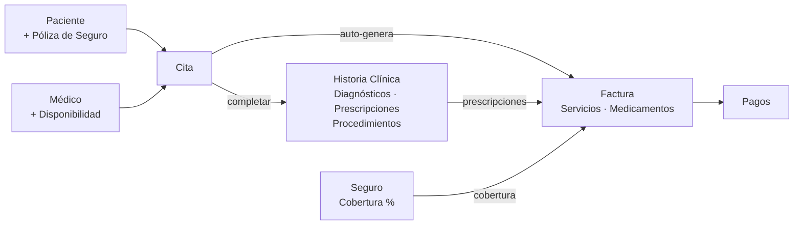
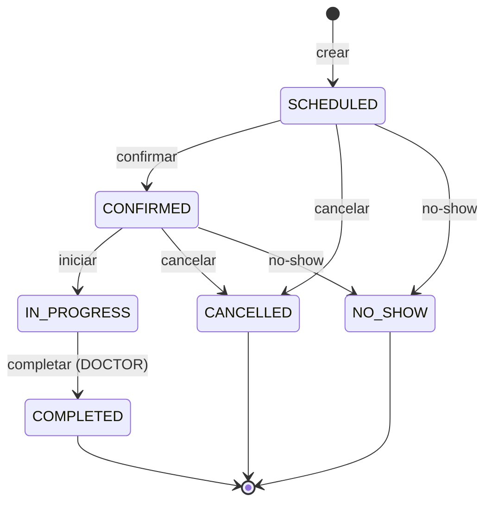
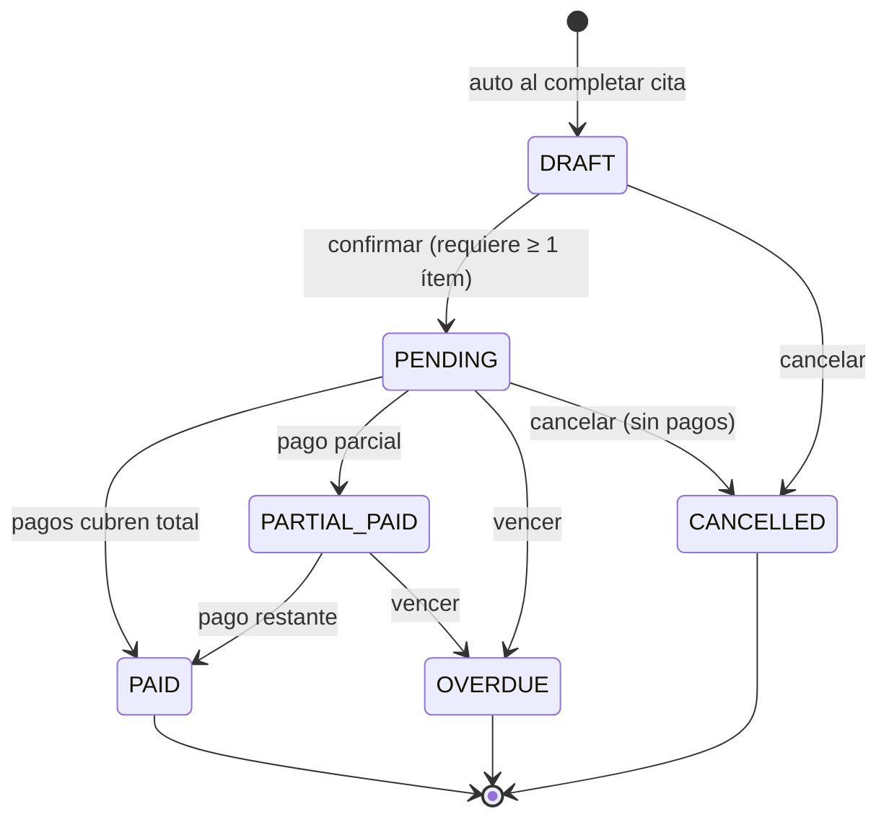
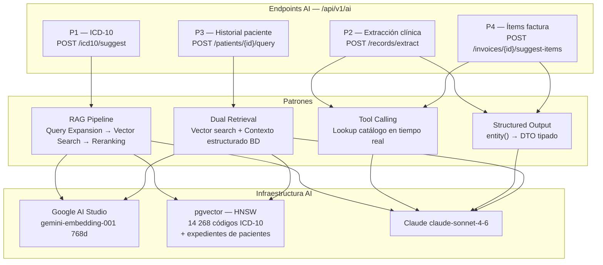
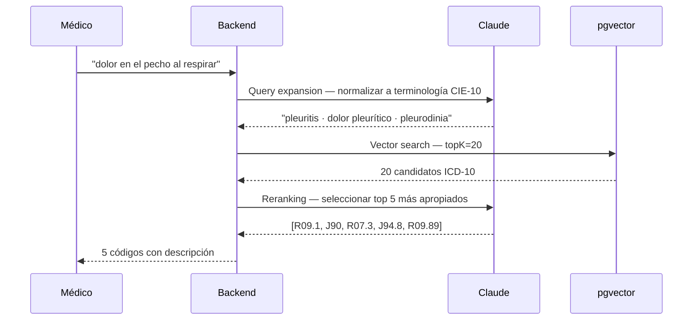
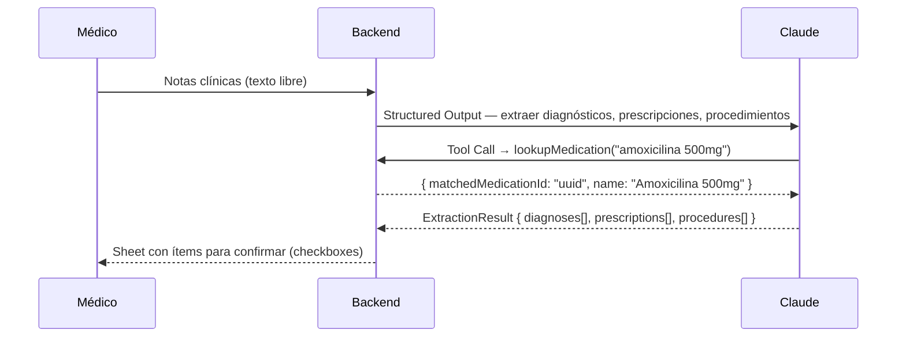
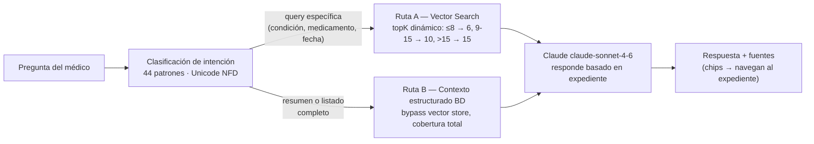
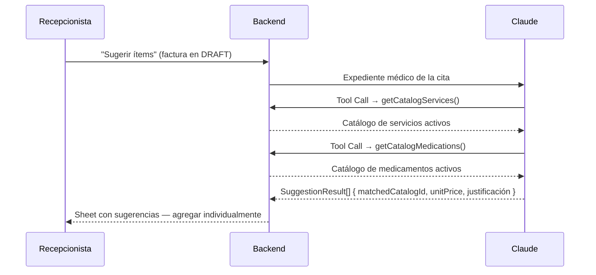
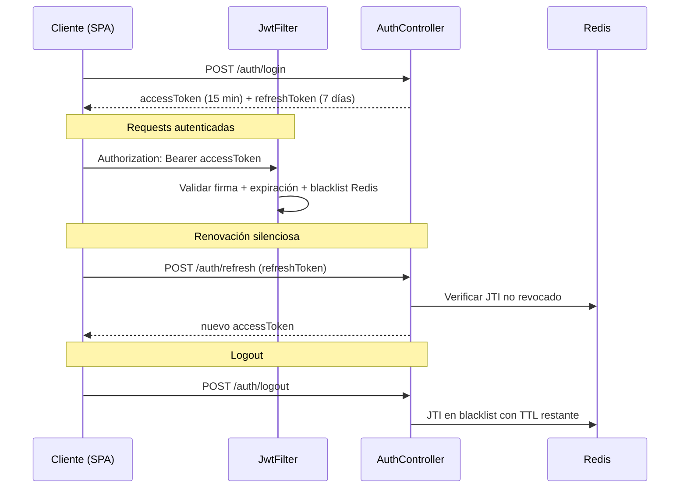
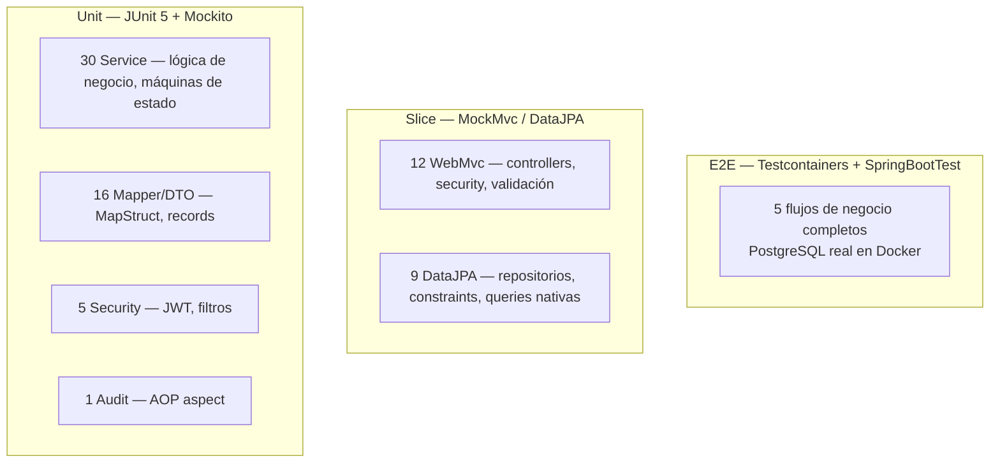

# Diagramas — Sistema de Facturación Médica

Diagramas de flujo, máquinas de estado y arquitectura detallada del sistema.

---

## Dominios de Negocio

El sistema modela el ciclo operativo completo de una clínica: desde el registro del paciente hasta el cobro final, pasando por la consulta médica.

---

## Máquina de estados — Citas

`complete` es la operación crítica: en una sola transacción crea la historia clínica, genera la factura en borrador con número secuencial y actualiza el estado de la cita.

---

## Máquina de estados — Facturas

---

## Arquitectura de IA

---

## P1 — RAG: Sugerencia de códigos ICD-10

Pipeline RAG de tres pasos para resolver el *vocabulary mismatch* entre el lenguaje coloquial médico y la terminología CIE-10 formal.

---

## P2 — Tool Calling + Structured Output: Extracción de notas clínicas

Analiza las notas libres de una consulta y extrae estructuradamente diagnósticos, prescripciones y procedimientos.

---

## P3 — RAG Dual: Consulta en lenguaje natural sobre historial del paciente

Arquitectura dual de recuperación que garantiza cobertura total independientemente del tamaño del historial.

---

## P4 — Tool Calling + Structured Output: Sugerencia de ítems de factura

Claude consulta el catálogo activo via Tool Calling y propone ítems de facturación justificados clínicamente.

---

## Flujo JWT — Autenticación y Renovación

---

## Pirámide de Testing — Backend

