# Sistema de Facturación Médica (SFM)

Sistema clínico fullstack con cuatro asistentes AI integrados: desde RAG sobre embeddings locales hasta Tool Calling y Structured Output con Claude. El backend es una API RESTful en Spring Boot 4 con máquinas de estados explícitas, auditoría dual y 370 tests. El frontend es un backoffice React 19 con routing type-safe, estado del servidor con TanStack Query y una suite de 740 tests.

---

## Arquitectura General

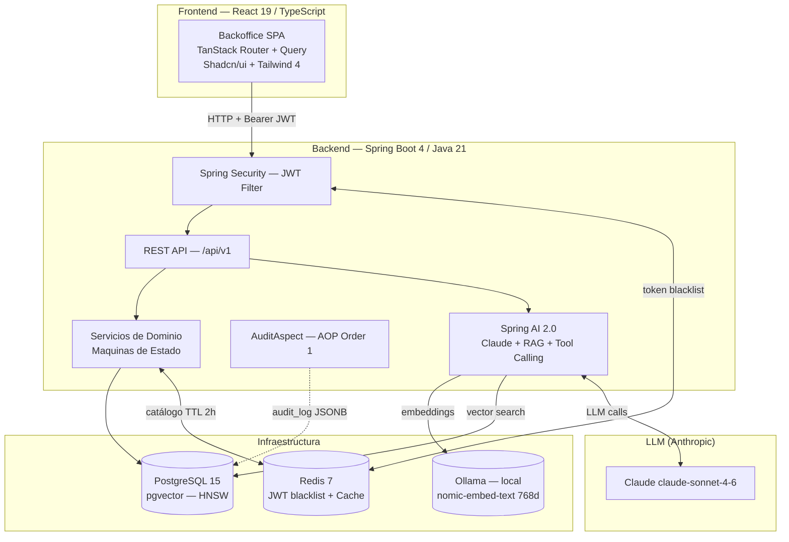

---

## Dominios de Negocio

El sistema modela el ciclo operativo completo de una clínica: desde el registro del paciente hasta el cobro final, pasando por la consulta médica.

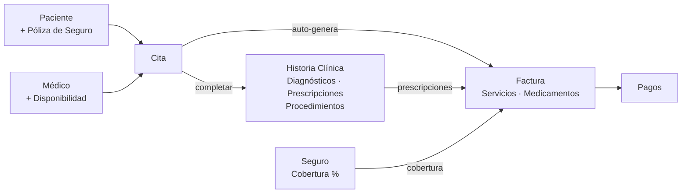

### Máquina de estados — Citas

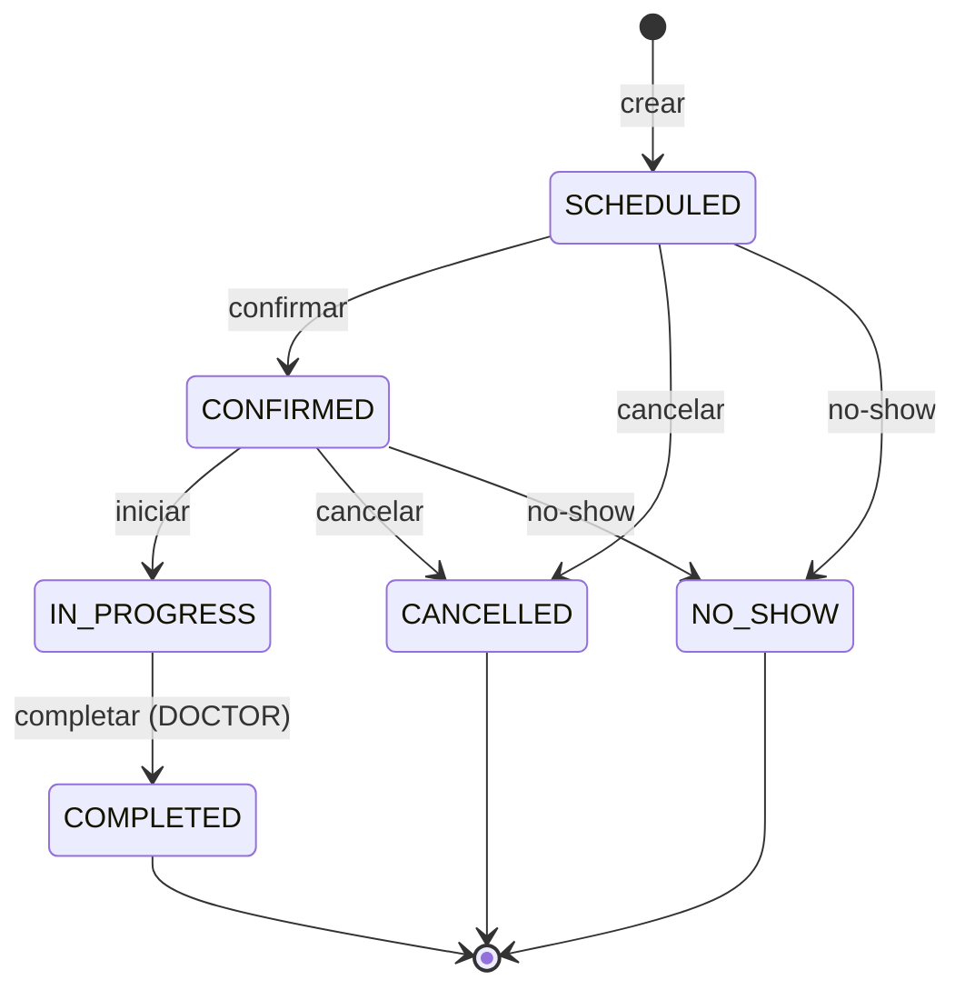

`complete` es la operación crítica: en una sola transacción crea la historia clínica, genera la factura en borrador con número secuencial y actualiza el estado de la cita.

### Máquina de estados — Facturas

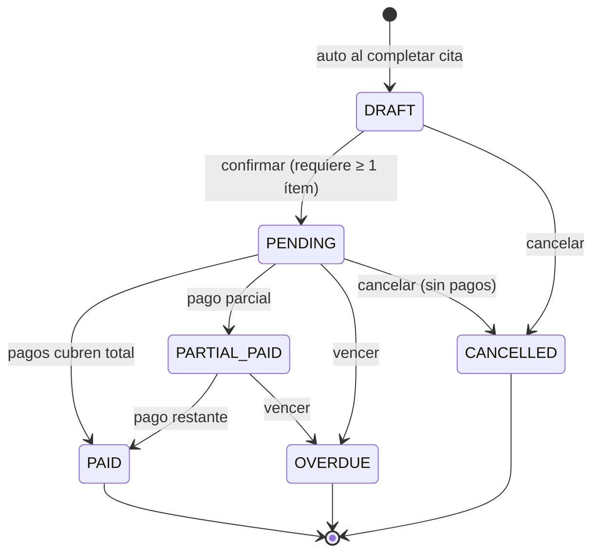

---

## Integraciones AI

Cuatro asistentes clínicos construidos con **Claude claude-sonnet-4-6** via **Spring AI 2.0**, con patrones avanzados de RAG, Tool Calling y Structured Output. Los embeddings los genera **Ollama** con `nomic-embed-text` (768 dims) corriendo localmente; el índice vectorial vive en **PostgreSQL** con `pgvector` (HNSW, distancia coseno).

### Stack de IA

| Componente | Tecnología |
|---|---|
| LLM | Claude claude-sonnet-4-6 (Anthropic) via Spring AI 2.0.0-M4 |
| Embeddings | nomic-embed-text 768 dims — Ollama local |
| Vector store | pgvector — índice HNSW, distancia coseno, PostgreSQL 15 |
| Patrones | RAG · Tool Calling · Structured Output · Query Expansion · Dual Retrieval |

### Arquitectura de IA

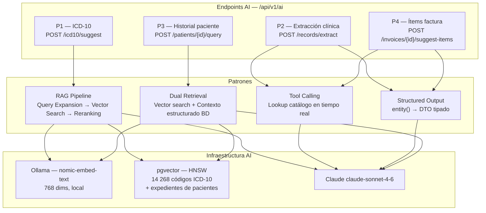

---

### P1 — RAG: Sugerencia de códigos ICD-10

> **Página:** Historia Clínica · **Componente:** `Icd10Suggester` · **Latencia:** 2–4 s

Pipeline RAG de tres pasos para resolver el *vocabulary mismatch* entre el lenguaje coloquial médico y la terminología CIE-10 formal. El catálogo completo de 14 268 códigos CIE-10 (nivel 2–5) se indexa asincrónamente al iniciar la aplicación.

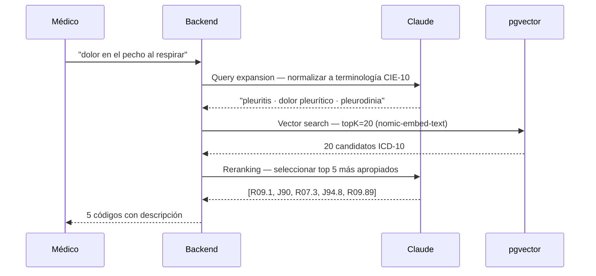

**Técnicas:** Query Expansion → Semantic Search → LLM Reranking

---

### P2 — Tool Calling + Structured Output: Extracción de notas clínicas

> **Página:** Historia Clínica · **Componente:** `ExtractionPanel` · **Latencia:** 3–6 s

Analiza las notas libres de una consulta y extrae estructuradamente diagnósticos, prescripciones y procedimientos. El Tool Calling resuelve el `matchedMedicationId` consultando el catálogo activo en tiempo real, evitando alucinaciones de IDs.

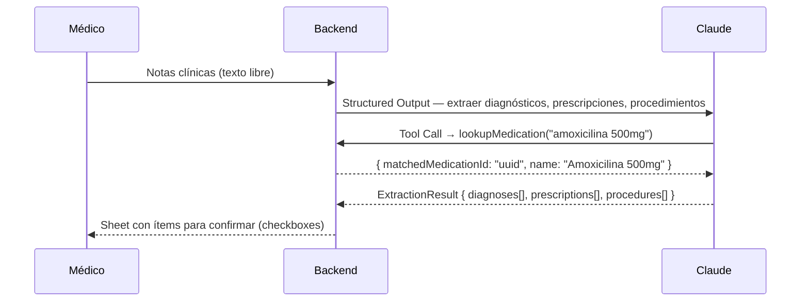

**Resultado:** El médico revisa y aplica los ítems con un click; los medicamentos sin match en catálogo quedan deshabilitados.

---

### P3 — RAG Dual: Consulta en lenguaje natural sobre historial del paciente

> **Página:** Detalle de Paciente · **Componente:** `PatientHistoryChat` · **Latencia:** 3–10 s

El médico formula preguntas en lenguaje natural sobre el historial clínico completo de un paciente. La arquitectura dual de recuperación garantiza cobertura total independientemente del tamaño del historial.

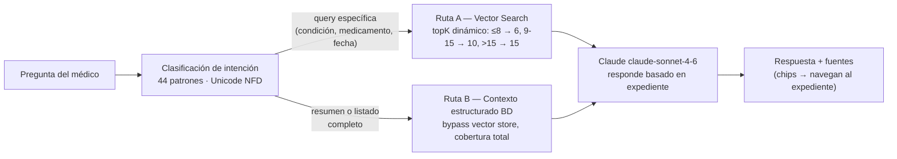

**Indexación:** On-demand en el primer query del paciente. Re-indexación asíncrona post-commit con `TransactionSynchronizationManager` tras cada modificación al expediente.

---

### P4 — Tool Calling + Structured Output: Sugerencia de ítems de factura

> **Página:** Detalle de Factura · **Componente:** `ItemSuggestionPanel` · **Latencia:** 3–5 s

A partir del expediente médico asociado a la factura (diagnósticos, prescripciones, procedimientos ya guardados), Claude consulta el catálogo activo via Tool Calling y propone ítems de facturación justificados clínicamente.

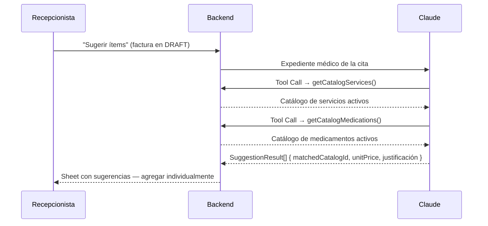

**Resultado:** Cada ítem se agrega con loading state independiente; sugerencias sin `matchedCatalogId` quedan deshabilitadas.

---

## Stack Tecnológico

| Capa | Backend | Frontend |
|---|---|---|
| Lenguaje | Java 21 | TypeScript 5.9 (strict) |
| Framework | Spring Boot 4 | React 19 + Vite 8 |
| Routing | — | TanStack Router 1.168 |
| Estado servidor | — | TanStack Query 5.94 |
| Persistencia | Spring Data JPA + Hibernate | — |
| Base de datos | PostgreSQL 15 + pgvector | — |
| Cache / sesiones | Redis 7 | — |
| Migraciones | Flyway | — |
| Seguridad | Spring Security + JWT (jjwt 0.12) | Axios interceptors |
| Validación | Jakarta Bean Validation | React Hook Form + Zod 4.3 |
| UI | — | Shadcn/ui + Radix UI + Tailwind 4 |
| Mapeo DTO | MapStruct 1.6 | — |
| Auditoría | JPA Auditing + AOP AspectJ | — |
| **IA — LLM** | **Spring AI 2.0 · Claude claude-sonnet-4-6** | **react-markdown + remark-gfm** |
| **IA — Embeddings** | **Ollama · nomic-embed-text (768 dims)** | — |
| **IA — Vector store** | **pgvector (HNSW, cosine)** | — |
| Testing | JUnit 5 + Mockito + Testcontainers + JaCoCo | Vitest 4 + RTL 16 + Playwright 1.59 |

---

## Seguridad y Autorización

### Flujo JWT

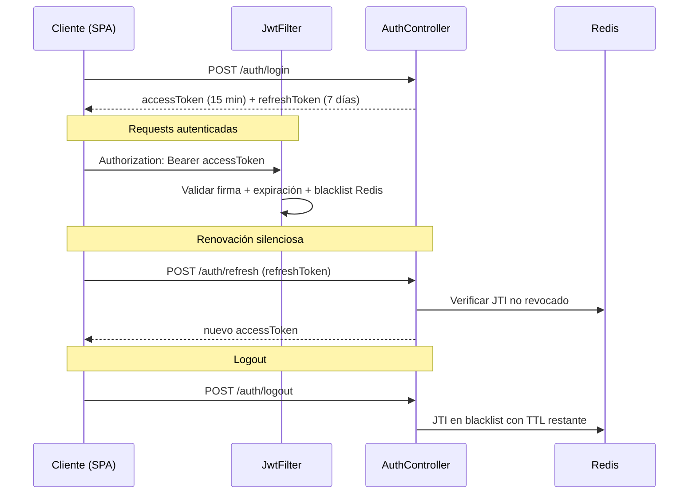

El frontend implementa un mutex `refreshInFlight` en el interceptor de respuesta: si múltiples requests reciben 401 simultáneamente, solo se lanza una llamada al endpoint de refresh y todas esperan la misma promesa.

### Matriz de Permisos

| Recurso | ADMIN | DOCTOR | RECEPTIONIST |
|---|---|---|---|
| Pacientes (escritura) | ✓ | — | ✓ |
| Médicos (escritura) | ✓ | — | — |
| Citas | ✓ | ✓ | ✓ |
| Completar cita | — | ✓ (propia) | — |
| Facturas | ✓ | — | ✓ (lectura + pagos) |
| Seguros (escritura) | ✓ | — | — |
| Catálogo (escritura) | ✓ | — | — |
| Historias clínicas | ✓ | ✓ | ✓ |
| Asistentes AI | ✓ | ✓ | ✓ |

Los permisos se aplican en tres niveles independientes: backend (`@PreAuthorize` / Spring Security), rutas frontend (`requireRole` en `beforeLoad`), y componentes (`useRolePermissions` deshabilita acciones).

---

## Reglas de Negocio Destacadas

**Validación de disponibilidad** — Al crear una cita el frontend consulta el endpoint de disponibilidad del médico para el día seleccionado y bloquea el submit si existe solapamiento temporal, sin depender del backend para la validación visual.

**Prescripciones requeridas** — Los medicamentos del catálogo pueden marcar `requiresPrescription = true`. Al intentar agregar uno a una factura, el backend valida que exista una prescripción para ese medicamento en la cita asociada (`prescriptionRepository.existsByAppointmentIdAndMedicationId`). Si no existe, lanza `BusinessRuleException` (422).

**Cobertura de seguro** — Al asignar una póliza a una factura, el backend recalcula en tiempo real `insuranceCoverage = (total × coveragePercentage / 100) − deductible` y actualiza `patientResponsibility`. Valida póliza activa, proveedor activo y vigencia de fechas.

**Numeración secuencial sin duplicados** — La generación del número de factura (`FAC-YYYY-NNNNN`) usa `SELECT FOR UPDATE` sobre `invoice_sequences` para garantizar unicidad bajo concurrencia.

**Cancelación con pagos (RN-14)** — No se puede cancelar una factura si ya tiene pagos aplicados.

**Auditoría dual** — Toda mutación sobre diagnósticos, prescripciones e ítems de factura genera un registro en `audit_log` con `old_values` y `new_values` en JSONB, capturado por `AuditAspect` después del commit de la transacción.

---

## Testing

### Backend — 370 tests, cobertura JaCoCo

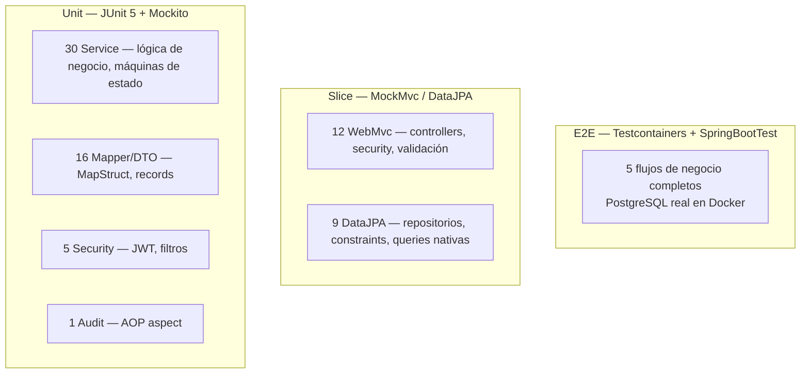

| Alcance | Líneas | Branches |
|---|---|---|
| Global | ≥ 80 % | ≥ 65 % |
| `invoice*`, `payment*`, `appointment*` | ≥ 90 % | ≥ 75 % |

Flujos E2E verificados con base de datos real:

- `AppointmentCompletionFlowE2ETest` — cita → completar → historia clínica + factura draft
- `InvoiceLifecyclePaymentFlowE2ETest` — draft → ítems → confirmar → pago parcial → pago total → PAID
- `MedicationPrescriptionFlowE2ETest` — medicamento con RX requerida → rechazo sin prescripción → éxito con prescripción
- `InsuranceCoverageFlowE2ETest` — asignar póliza → verificar cálculo de cobertura
- `CancellationRulesFlowE2ETest` — cancelar sin pagos (éxito) → cancelar con pagos (rechazo RN-14)

### Frontend — 740 tests

| Capa | Tests | Herramientas |
|---|---|---|
| Unit / componentes | 614 (49 archivos) | Vitest 4 + React Testing Library 16 |
| E2E | 126 (5 archivos) | Playwright 1.59 + Chromium |

Los E2E cubren los flujos críticos de usuario completos: auth por rol, CRUD de pacientes, ciclo de vida de citas, ciclo de facturación y matriz de permisos por rol.

---

## Estructura del Repositorio

```
/
├── backend/                 # Spring Boot 4 — API REST
│   ├── src/main/java/
│   │   └── com/fepdev/sfm/backend/
│   │       ├── config/      # Security, JPA, Cache, AI
│   │       ├── security/    # JWT, filtros, roles
│   │       ├── shared/      # BaseEntity, excepciones, AuditAspect
│   │       ├── domain/      # patient, doctor, appointment, medicalrecord,
│   │       │                # invoice, payment, insurance, catalog, auth
│   │       └── ai/          # P1 icd10 (RAG) · P2 extraction · P3 history · P4 suggestion
│   ├── src/main/resources/
│   │   ├── db/migration/    # Flyway V1–V11 (incluye pgvector)
│   │   └── data/cie-10.csv  # 14 268 códigos CIE-10 nivel 2–5
│   └── src/test/java/       # unit, web, persistence, integration/e2e
│
├── frontend/                # React 19 — Backoffice SPA
│   ├── src/
│   │   ├── features/        # auth, patients, doctors, appointments,
│   │   │                    # medical-records, invoices, insurance, catalog,
│   │   │                    # dashboard, ai
│   │   ├── components/      # AppShell, DataTable, AllergyAlert, BackToListButton
│   │   ├── lib/             # apiClient (Axios + interceptors), queryClient, utils
│   │   └── types/           # Espejo exacto de DTOs Java
│   ├── e2e/                 # Playwright specs
│   └── docs/                # Documentación técnica (testing, etc.)
│
└── docker-compose.yml       # PostgreSQL 15 (pgvector) + Redis 7
```

---

## Levantar el Proyecto

### 1. Infraestructura

```bash
docker compose up -d
# PostgreSQL en :5434 — Redis en :6379
```

### 2. Ollama (embeddings locales para AI)

```bash
ollama pull nomic-embed-text
# Servidor disponible en http://localhost:11434
```

### 3. Backend

```bash
cd backend
./mvnw spring-boot:run -Dspring-boot.run.profiles=dev
# API disponible en http://localhost:8080/api/v1
# Al iniciar: indexación asíncrona de 14 268 códigos ICD-10 en pgvector
```

### 4. Frontend

```bash
cd frontend
npm install
npm run dev
# SPA disponible en http://localhost:5173
```

### Usuarios de desarrollo

| Usuario | Contraseña | Rol |
|---|---|---|
| `admin` | `admin123` | ADMIN |
| `doctor1` | `doctor123` | DOCTOR |
| `recep1` | `recep123` | RECEPTIONIST |

---

## Documentación por Módulo

| Módulo | README |
|---|---|
| Backend | [`backend/README.md`](backend/README.md) |
| Frontend | [`frontend/README.md`](frontend/README.md) |
| Testing frontend | [`frontend/docs/02-testing.md`](frontend/docs/02-testing.md) |
