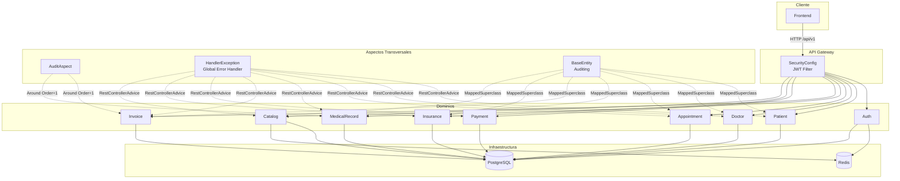
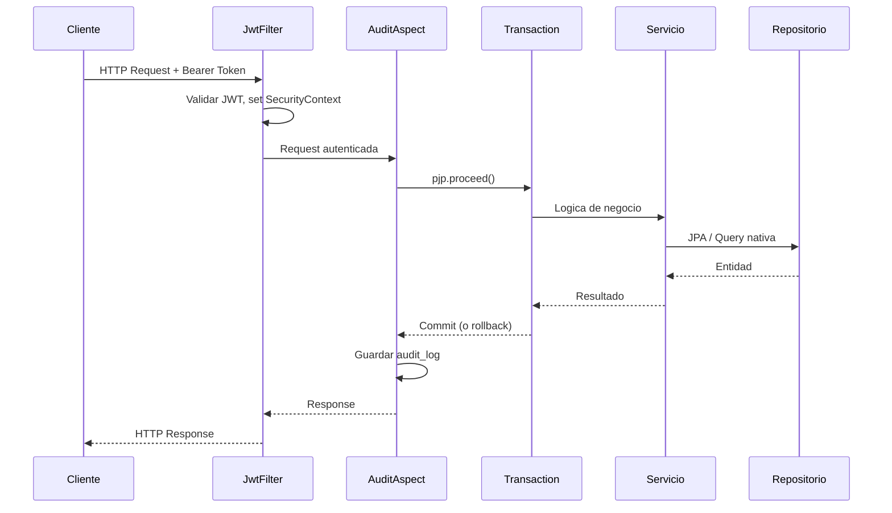
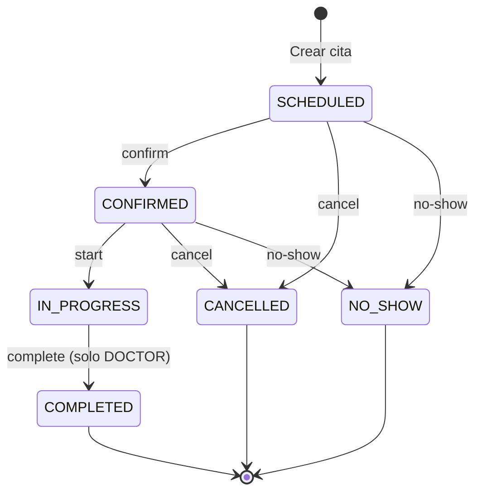
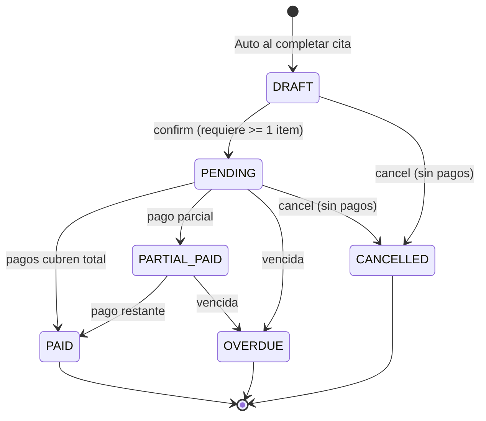
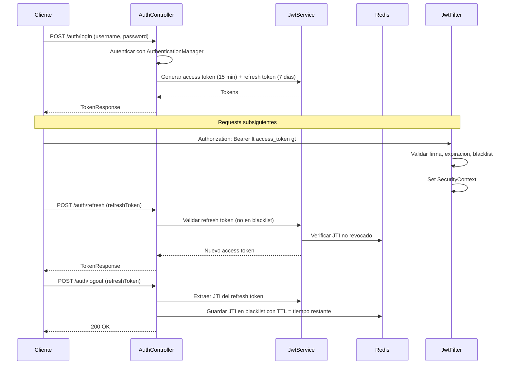
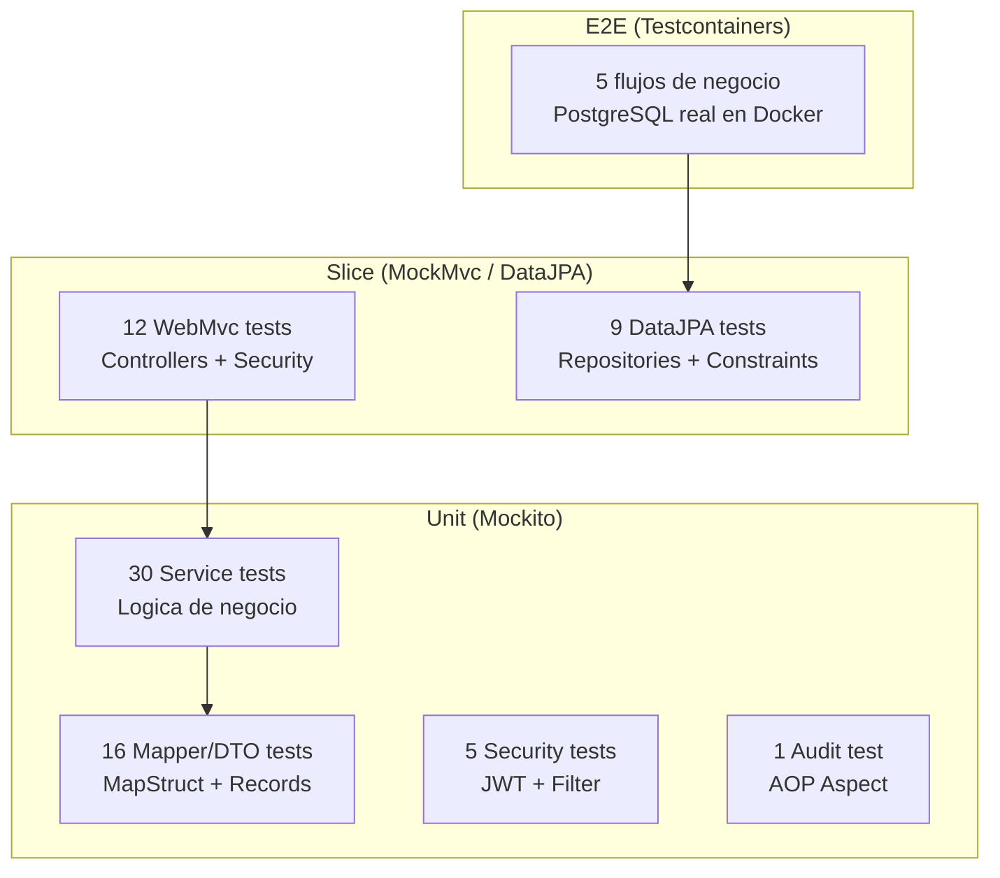

# SFM Backend -- Sistema de Facturacion Medica

Backend RESTful para la gestion integral de una clinica medica: agendamiento de citas, historias clinicas, recetas, facturacion con cobertura de seguros, y pagos. Construido sobre Spring Boot 4 con Java 21, PostgreSQL y Redis.

---

## Stack Tecnologico

| Capa | Tecnologia |
|---|---|
| Runtime | Java 21, Spring Boot 4.0.3 |
| Persistencia | Spring Data JPA, Hibernate, PostgreSQL 15 |
| Migraciones | Flyway |
| Cache / Revocacion | Redis 7 |
| Seguridad | Spring Security, JWT (jjwt 0.12.5), BCrypt |
| Mapeo DTO | MapStruct 1.6.3 |
| Validacion | Jakarta Bean Validation |
| Auditoria | Spring Data Auditing, AOP (AspectJ) |
| Monitoreo | Spring Boot Actuator |
| IA — LLM | Spring AI 2.0.0-M4, Anthropic Claude (claude-sonnet-4-6) |
| IA — Embeddings | Ollama (nomic-embed-text, 768 dims, local) |
| IA — Vector store | pgvector (HNSW, cosine distance) |
| Testing | JUnit 5, Mockito, MockMvc, Testcontainers, JaCoCo |

---

## Arquitectura

Monolito modular organizado por dominio de negocio. Cada dominio encapsula sus entidades, repositorios, servicios, mappers (MapStruct), DTOs y controladores.



### Capas por Request



`AuditAspect` se ejecuta en `@Order(1)` como capa mas externa. Cuando `pjp.proceed()` retorna, la transaccion del servicio ya fue confirmada. Si el servicio lanza excepcion, el aspecto la relanza sin guardar ningun audit.

---

## Dominios de Negocio

### 1. Pacientes (`/api/v1/patients`)

CRUD de pacientes con busqueda por DNI, autocompletado, y consultas de citas, polizas y facturas asociadas.

### 2. Doctores (`/api/v1/doctors`)

CRUD de medicos con busqueda por numero de licencia, listado con filtros de especialidad/estado activo, y consulta de horarios ocupados.

### 3. Citas (`/api/v1/appointments`)

Gestion del ciclo de vida de citas con maquina de estados explicita:



**`complete` (PATCH, rol DOCTOR)** es la operacion critica: en una sola transaccion crea la historia clinica, genera la factura draft con numero secuencial, y actualiza el estado de la cita a `COMPLETED`.

### 4. Historias Clinicas (`/api/v1/medical-records`)

Gestion de historias clinicas con diagnosticos (codigos ICD-10), prescripciones de medicamentos (con validacion de prescripcion requerida), y procedimientos. Una historia clinica se crea automaticamente al completar una cita.

### 5. Facturacion (`/api/v1/invoices`)

Sistema completo de facturacion con maquina de estados:



Reglas de negocio clave:
- **Numeracion secuencial**: `FAC-YYYY-NNNNN` generada con bloqueo pesimista (`SELECT FOR UPDATE`) en `invoice_sequences` para evitar duplicados en concurrencia.
- **Items**: solo se pueden agregar/eliminar en estado `DRAFT`. Los items de tipo `SERVICE` y `MEDICATION` se validan contra el catalogo (activo). Los medicamentos que requieren prescripcion se validan contra recetas existentes en la cita asociada.
- **Cobertura de seguros**: al asignar una poliza se recalculan `insuranceCoverage` y `patientResponsibility` usando `(total * coveragePercentage / 100) - deductible`, con validaciones de poliza activa, proveedor activo, y vigencia de fechas.
- **Cancelacion**: regla RN-14 -- no se puede cancelar si ya tiene pagos aplicados.

### 6. Pagos (`/api/v1/payments`)

Registro de pagos contra facturas. Cada pago actualiza el estado de la factura automaticamente: `PENDING` -> `PARTIAL_PAID` -> `PAID` segun el acumulado.

### 7. Seguros (`/api/v1/insurance`)

Gestion de proveedores de seguros y polizas vinculadas a pacientes. Las polizas se validan (activo, proveedor activo, fechas de cobertura) al asignarlas a facturas.

### 8. Catalogos (`/api/v1/catalog`)

Catalogos maestros de servicios y medicamentos con:
- Borrado logico (deactivate, no delete fisico).
- Historial de precios (`catalog_price_history`) con registro automatico de cambios.
- Cache en Redis con TTL de 2 horas.

### 9. Integraciones AI (`/api/v1/ai`)

Tres endpoints de asistencia clinica potenciados por Claude (Anthropic) y un pipeline RAG local:

#### P2 — Extraccion de notas clinicas (`POST /api/v1/ai/records/extract`)

Analiza las notas de una consulta y extrae estructuradamente:
- **Diagnosticos** con codigo ICD-10 sugerido y severidad.
- **Prescripciones** con medicacion, dosis, frecuencia y duracion; resuelve el `matchedMedicationId` contra el catalogo activo via Tool Calling.
- **Procedimientos** con codigo y descripcion.

Patron: Structured Output (`entity()`) + Tool Calling para lookup de catalogo.

#### P4 — Sugerencia de items de factura (`POST /api/v1/ai/invoices/{id}/suggest-items`)

A partir del expediente medico de la cita asociada a la factura (diagnosticos, prescripciones, procedimientos ya guardados), sugiere servicios y medicamentos del catalogo para agregar como items de facturacion. Cada sugerencia incluye `matchedCatalogId`, precio unitario y justificacion clinica.

Patron: Tool Calling para consultar el catalogo + Structured Output.

#### P1 — Sugerencia de codigos ICD-10 (`POST /api/v1/ai/icd10/suggest`)

Pipeline RAG de tres pasos para resolver el vocabulary mismatch entre lenguaje coloquial medico y terminologia CIE-10 formal:

1. **Query expansion** — Claude normaliza la descripcion coloquial a terminologia CIE-10 formal.
2. **Vector search** — busqueda semantica en pgvector (topK=20) con embeddings de `nomic-embed-text` (Ollama local, 768 dims, HNSW cosine).
3. **Reranking** — Claude selecciona los 5 codigos mas apropiados del pool de candidatos.

El catalogo completo de 14,268 codigos CIE-10 nivel 2-5 se indexa asincronomante al iniciar la aplicacion (si el vector store esta vacio).

---

## Autenticacion y Autorizacion

### Flujo JWT



### Matriz de Permisos

| Recurso | Lectura | Escritura |
|---|---|---|
| `/api/v1/auth/**` | Publico | Publico |
| `/api/v1/catalog/**` | Autenticado | ADMIN |
| `/api/v1/doctors` | Autenticado | ADMIN |
| `/api/v1/insurance/**` | Autenticado | ADMIN |
| `/api/v1/patients` | Autenticado | ADMIN, RECEPTIONIST |
| `/api/v1/payments` | Autenticado | ADMIN, RECEPTIONIST |
| `/api/v1/appointments/*/complete` | -- | DOCTOR |
| `/api/v1/medical-records/**` | Autenticado | Autenticado |
| `/api/v1/invoices/**` | Autenticado | Autenticado |

### Usuarios por Defecto

| Username | Password | Rol |
|---|---|---|
| `admin` | `admin123` | ADMIN |
| `doctor1` | `doctor123` | DOCTOR |
| `recep1` | `recep123` | RECEPTIONIST |

---

## Base de Datos

PostgreSQL 15 con extensiones `uuid-ossp`, `pgcrypto`, `btree_gist`.

### Migraciones (Flyway)

| Version | Archivo | Contenido |
|---|---|---|
| V1 | `init_extensions.sql` | Extensiones PostgreSQL |
| V2 | `create_schema.sql` | Esquema principal: 13 tablas con constraints, indices y comentarios |
| V3 | `catalog_price_history.sql` | Tabla de historial de precios de catalogo |
| V4 | `constraints_and_indexes.sql` | `invoice_sequences`, constraint unique en medical_records, indices GIN full-text |
| V5 | `create_system_users.sql` | Tabla `system_users` + seed usuario admin |
| V6 | `audit_fields_and_audit_log.sql` | Campos `created_by`/`updated_by` en todas las entidades + tabla `audit_log` |
| V7 | `seeds.sql` (dev) | Datos de desarrollo: pacientes, doctores, seguros, citas, facturas, pagos |
| V8 | `seed_system_users_roles.sql` | Seed usuarios doctor1 y recep1 |
| V9 | `link_doctors_system_users.sql` | Vinculacion de system_users con doctors |
| V10 | `pgvector_extension.sql` | Habilita la extension `vector` en PostgreSQL (requiere imagen `pgvector/pgvector:pg15`) |
| V11 | `vector_store_table.sql` | Tabla `vector_store` con columna `embedding vector(768)` e indice HNSW cosine para RAG |

### Auditoria Dual

1. **JPA Auditing** (`BaseEntity`): `created_at`, `updated_at`, `created_by`, `updated_by` en todas las entidades principales. El `created_by` se resuelve desde `SecurityContext` via `SpringSecurityAuditorAware`.
2. **Audit Trail** (`AuditAspect`): registros en `audit_log` con `old_values` y `new_values` en formato JSONB para operaciones sobre Diagnosis, Prescription e Invoice (creacion, transiciones de estado, items).

---

## Manejo de Errores

`HandlerException` (`@RestControllerAdvice`) mapea excepciones a respuestas HTTP consistentes:

| Excepcion | HTTP Status | Caso de Uso |
|---|---|---|
| `EntityNotFoundException` | 404 | Recurso no encontrado |
| `MethodArgumentNotValidException` | 400 | Validacion de campos (Bean Validation) |
| `BusinessRuleException` | 422 | Violacion de regla de negocio |
| `DataIntegrityViolationException` | 409 | Conflicto de datos (unique constraint, FK) |
| `AuthenticationException` | 401 | Credenciales invalidas o token expirado |
| `AccessDeniedException` | 403 | Sin permisos suficientes |

Formato de respuesta: `{ timestamp, status, error, message, path }`

---

## Estrategia de Testing

Piramide de tests con tres capas, 370 tests totales, cobertura exigida por JaCoCo.

### Umbrales JaCoCo

| Alcance | Lineas | Branches |
|---|---|---|
| Global (bundle) | 80% | 65% |
| `invoice*`, `payment*`, `appointment*` | 90% | 75% |

### Capas de Testing



| Capa | Cantidad | Framework | Proposito |
|---|---|---|---|
| Unitarios | ~52 | JUnit 5 + Mockito | Logica de servicio, mappers, enums, converters |
| WebMvc | ~12 | MockMvc + @WebMvcTest | Controladores, validacion, autorizacion HTTP |
| DataJPA | ~9 | Testcontainers + @DataJpaTest | Repositorios, queries nativas, constraints DB |
| E2E | ~5 | Testcontainers + SpringBootTest | Flujos completos de negocio contra BD real |
| Totales | **370** | -- | **0 fallos, BUILD SUCCESS** |

### Flujos E2E

| Test | Flujo de Negocio Verificado |
|---|---|
| `AppointmentCompletionFlowE2ETest` | Crear cita -> completar -> verifica historia clinica + factura draft creada |
| `InvoiceLifecyclePaymentFlowE2ETest` | Factura draft -> agregar items -> confirmar -> pagar parcial -> pagar total -> estado PAID |
| `MedicationPrescriptionFlowE2ETest` | Medicamento con prescripcion requerida -> agregar a factura sin receta -> rechazo -> agregar con receta -> exito |
| `InsuranceCoverageFlowE2ETest` | Asignar poliza a factura -> verificar calculo de cobertura y responsabilidad del paciente |
| `CancellationRulesFlowE2ETest` | Cancelar factura sin pagos -> exito | intentar cancelar con pagos -> rechazo (RN-14) |

---

## Configuracion

### Perfiles

| Perfil | Uso | Flyway Seeds | SQL Logging |
|---|---|---|---|
| `dev` | Desarrollo local | Incluidos | Activado |
| `docker` | Docker Compose | Excluidos | Desactivado |
| `test` | Tests unitarios/integracion | Excluidos | Desactivado |
| `persistence` | Tests de persistencia dedicados | Excluidos | Desactivado |

### Variables de entorno (produccion)

Las credenciales y URLs de produccion se configuran mediante variables de entorno o un `application-prod.yml` que no esta versionado. Variables clave:

- `SPRING_DATASOURCE_URL`
- `SPRING_DATASOURCE_USERNAME`
- `SPRING_DATASOURCE_PASSWORD`
- `SPRING_DATA_REDIS_HOST`
- `JWT_SECRET` (Base64)

### Cache Redis (TTLs)

| Cache | TTL |
|---|---|
| `services`, `services-list` | 2 horas |
| `medications`, `medications-list` | 2 horas |
| `insurance-providers` | 1 hora |

---

## Comandos Utiles

### Requisitos previos

- Java 21
- Maven 3.9+
- Docker y Docker Compose (para infraestructura y Testcontainers)

### Infraestructura local

```bash
docker compose up -d
```

Inicia PostgreSQL (puerto 5434) y Redis (puerto 6379).

### Ejecutar en desarrollo

```bash
./mvnw spring-boot:run -Dspring-boot.run.profiles=dev
```

### Compilar

```bash
./mvnw clean package -DskipTests
```

### Ejecutar tests completos con cobertura

```bash
./mvnw clean verify
```

Ejecuta todos los tests (unitarios, WebMvc, DataJPA, E2E), genera reporte JaCoCo en `target/site/jacoco/index.html`, y valida umbrales de cobertura.

### Ejecutar una capa especifica de tests

```bash
./mvnw test -Dtest="com.fepdev.sfm.backend.domain.invoice.**"
./mvnw test -Dtest="com.fepdev.sfm.backend.web.**"
./mvnw test -Dtest="com.fepdev.sfm.backend.persistence.**"
./mvnw test -Dtest="com.fepdev.sfm.backend.integration.e2e.**"
```

### Ejecutar un solo test

```bash
./mvnw test -Dtest="com.fepdev.sfm.backend.domain.invoice.InvoiceServiceTest"
```

### Reporte de cobertura

```bash
./mvnw jacoco:report
# Abrir target/site/jacoco/index.html
```

### Verificar solo umbrales de cobertura (sin recompilar)

```bash
./mvnw jacoco:check
```

---

## Estructura del Proyecto

```
backend/
  src/main/java/com/fepdev/sfm/backend/
    BackendApplication.java
    config/                         # SecurityConfig, JpaConfig, CacheConfig
    security/                       # JWT, filtros, SystemUser, roles
    shared/
      domain/BaseEntity.java        # Superclase con id, audit fields
      exception/                    # HandlerException, BusinessRuleException
      audit/                        # AuditAspect, AuditLog
    domain/
      patient/                      # Pacientes
      doctor/                       # Medicos
      appointment/                  # Citas
      medicalrecord/                # Historias clinicas, diagnosticos, recetas, procedimientos
      invoice/                      # Facturacion, items, secuencias
      payment/                      # Pagos
      insurance/                    # Proveedores y polizas de seguros
      catalog/                      # Catalogos de servicios y medicamentos
      auth/                         # Login, refresh, logout
    ai/
      config/                       # AiConfig: ChatClient (AnthropicChatModel)
      extraction/                   # P2: extraccion de notas clinicas (Tool Calling)
      suggestion/                   # P4: sugerencia de items de factura (Tool Calling)
      icd10/                        # P1: sugerencia ICD-10 (RAG: normalize + vector search + rerank)
  src/main/resources/
    application.yml
    application-dev.yml
    application-docker.yml
    application-test.yml
    db/migration/                   # Flyway migrations (V1-V11)
    db/seeds/                       # Datos de desarrollo (V7)
    data/cie-10.csv                 # Catalogo CIE-10 en espanol (14,268 codigos nivel 2-5)
  src/test/java/com/fepdev/sfm/backend/
    domain/                         # Tests unitarios de servicios, mappers, DTOs
    web/                            # Tests WebMvc de controladores
    security/                       # Tests de JWT y seguridad
    shared/audit/                   # Tests de AOP audit
    persistence/                    # Tests DataJPA con Testcontainers
    integration/e2e/                # Tests E2E de flujos de negocio
```
