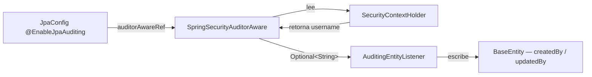
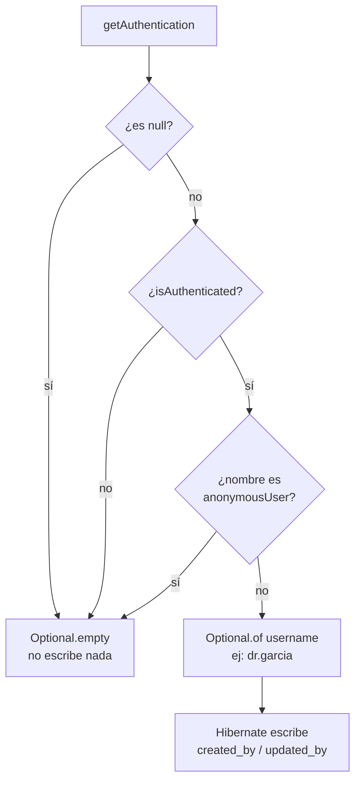
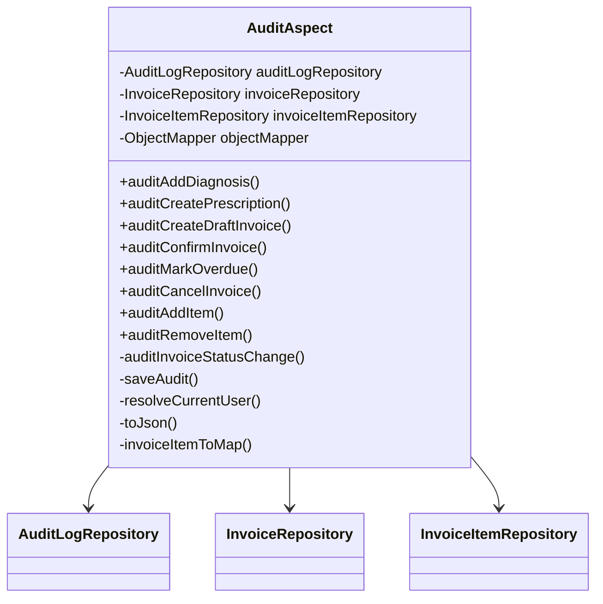
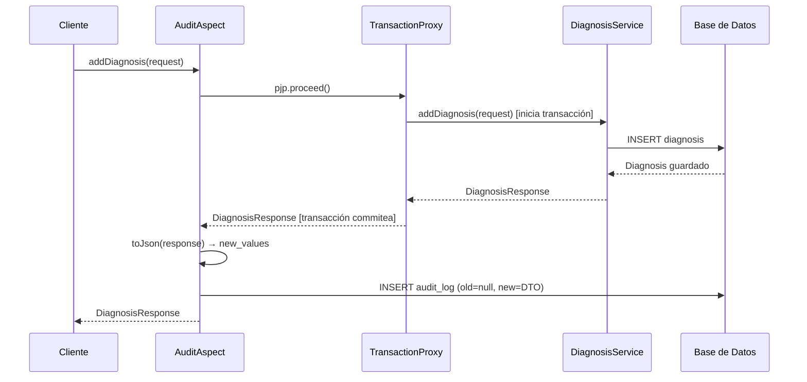
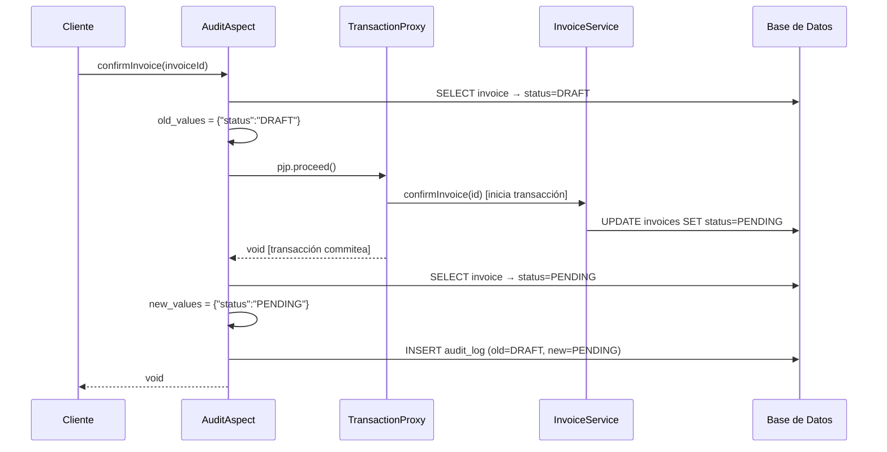
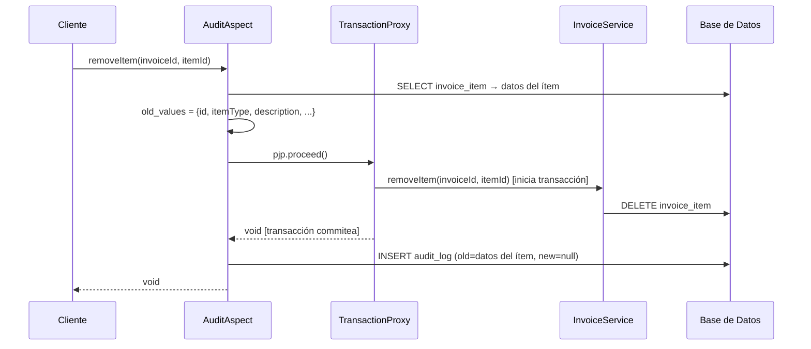

# Auditoría — Guía Completa

Dos mecanismos de auditoría trabajan juntos en este proyecto: campos automáticos en entidades (12.1) y registro de operaciones sensibles en `audit_log` (12.2).

---

## Archivos del módulo

```
config/
  SpringSecurityAuditorAware.java   — resuelve el usuario autenticado actual
  JpaConfig.java                    — activa JPA Auditing y enlaza el AuditorAware

shared/
  domain/
    BaseEntity.java                 — campos @CreatedBy / @LastModifiedBy heredados por todas las entidades
  audit/
    AuditAction.java                — enum: CREATE, UPDATE
    AuditLog.java                   — entidad de la tabla audit_log
    AuditLogRepository.java         — repositorio con query por entidad
    AuditAspect.java                — aspecto @Around con @Order(1)

db/migration/
  V6__audit_fields_and_audit_log.sql — columnas created_by/updated_by + tabla audit_log
```

---

## 12.1 Auditoría Automática de Campos (Spring Data JPA Auditing)

Todos los campos `created_at`, `updated_at`, `created_by` y `updated_by` se pueblan automáticamente en cada `save()`. No hay que asignarlos manualmente en ningún servicio.

### Piezas que intervienen



### BaseEntity — campos heredados por todas las entidades

```java
@CreatedDate
@Column(name = "created_at", updatable = false, nullable = false)
private OffsetDateTime createdAt;   // se asigna una sola vez al crear

@LastModifiedDate
@Column(name = "updated_at", nullable = false)
private OffsetDateTime updatedAt;   // se actualiza en cada save()

@CreatedBy
@Column(name = "created_by", updatable = false)
private String createdBy;           // username al crear (nullable hasta que haya seguridad activa)

@LastModifiedBy
@Column(name = "updated_by")
private String updatedBy;           // username del último que modificó
```

### SpringSecurityAuditorAware

`AuditorAware<String>` es una interfaz de Spring Data con un solo método: `getCurrentAuditor()`. Spring la llama automáticamente en cada `save()`. El `<String>` indica que el auditor es un String — el username.

```java
@Component("springSecurityAuditorAware")
public class SpringSecurityAuditorAware implements AuditorAware<String> {

    @Override
    public Optional<String> getCurrentAuditor() {
        return Optional.ofNullable(SecurityContextHolder.getContext().getAuthentication())
                .filter(Authentication::isAuthenticated)
                // "anonymousUser" es el nombre por defecto de Spring Security para requests sin sesion
                .filter(auth -> !"anonymousUser".equals(auth.getName()))
                .map(Authentication::getName);
    }
}
```

La cadena de Optional maneja tres casos:



Cuando retorna `empty`, Spring no escribe nada en los campos — por eso son nullable.

### Conexión con JpaConfig

```java
@EnableJpaAuditing(auditorAwareRef = "springSecurityAuditorAware")
public class JpaConfig {}
```

`auditorAwareRef` recibe el nombre del bean, que debe coincidir exactamente con `@Component("springSecurityAuditorAware")`. Sin ese ref, la auditoría de fechas funciona pero Spring lanza error al intentar poblar `@CreatedBy` y `@LastModifiedBy` porque no sabe qué bean usar.

### Migración de BD (V6)

Los campos `created_by` y `updated_by` se agregaron como `NULLABLE` a las 14 tablas principales. Son nullable porque las filas existentes no tienen usuario asignado. Una vez que la seguridad JWT esté activa (FASE 17), todos los registros nuevos tendrán el username.

```sql
ALTER TABLE patients ADD COLUMN IF NOT EXISTS created_by VARCHAR(255);
ALTER TABLE patients ADD COLUMN IF NOT EXISTS updated_by VARCHAR(255);
-- ... igual para las demás tablas
```

---

## 12.2 Registro de Operaciones Sensibles (audit_log + AOP)

Para diagnósticos, prescripciones y facturas se registra cada operación en la tabla `audit_log` con el estado anterior y posterior en JSON (RN-22).

### Tabla audit_log

```sql
CREATE TABLE audit_log (
    id           UUID         PRIMARY KEY DEFAULT uuid_generate_v4(),
    entity_name  VARCHAR(100) NOT NULL,   -- "Diagnosis", "Prescription", "Invoice"
    entity_id    UUID         NOT NULL,   -- UUID de la entidad afectada
    action       VARCHAR(20)  NOT NULL,   -- CREATE o UPDATE
    performed_by VARCHAR(255) NOT NULL,   -- username del SecurityContext
    performed_at TIMESTAMPTZ  NOT NULL DEFAULT NOW(),
    old_values   JSONB,                   -- null en CREATE
    new_values   JSONB,                   -- null en eliminaciones de subrecursos
    CONSTRAINT chk_audit_action CHECK (action IN ('CREATE', 'UPDATE'))
);
```

### Por qué AOP y no @EntityListeners

`@EntityListeners` con `@PreUpdate` no puede capturar el estado anterior sin una query extra dentro de la transacción, y no inyecta beans de Spring fácilmente.

El aspecto AOP con `@Around` permite interceptar en la capa de servicio, inyectar cualquier bean, y controlar exactamente qué se audita y cuándo.

### AuditAspect — estructura general

El aspecto es un bean de Spring con cuatro dependencias:



`InvoiceRepository` e `InvoiceItemRepository` se inyectan porque el aspecto necesita leer el estado de la BD antes y después de las operaciones de factura.

### @Order(1) — por qué importa el orden

Spring apila los proxies AOP como capas de una cebolla. El orden determina quién envuelve a quién:

```mermaid
flowchart LR
    Cliente -->|llama| A
    subgraph A["AuditAspect @Order(1) — capa externa"]
        subgraph B["TransactionProxy @Order=MAX — capa interna"]
            C[Servicio\n@Transactional]
        end
    end
```

Con `@Order(1)` el aspecto es la capa más externa. Cuando `pjp.proceed()` retorna al aspecto, la transacción del servicio **ya fue confirmada**. Esto es clave para dos cosas:

1. Para `old_values`: leer de la BD antes del `proceed()` — lee datos consistentes sin entrar en la transacción del servicio
2. Para `new_values` en métodos void: leer de la BD después del `proceed()` — la transacción ya commitó, los datos nuevos son visibles

Si el servicio lanza una excepción, el aspecto la re-lanza sin guardar nada — no quedan registros huérfanos de operaciones fallidas.

### Flujo de un método CREATE (addDiagnosis)



### Flujo de un método UPDATE void (confirmInvoice)

Estos métodos son más complejos porque retornan void y necesitan capturar el estado antes y después:



### Flujo de removeItem — captura antes de eliminar



### Métodos privados del aspecto

| Método | Qué hace |
|---|---|
| `auditInvoiceStatusChange()` | lógica compartida para confirm/overdue/cancel: lee status antes y después |
| `saveAudit()` | construye el `AuditLog` con builder y lo persiste |
| `resolveCurrentUser()` | lee el username del SecurityContext, fallback `"system"` si no hay sesión |
| `toJson(Object)` | serializa con Jackson, retorna string de error si falla la serialización |
| `toJson(Map)` | variante tipada para usar con lambdas |
| `invoiceItemToMap()` | proyecta un `InvoiceItem` a un Map serializable para `old_values` |

### Operaciones auditadas — resumen

| Método | Entidad | Action | old_values | new_values |
|---|---|---|---|---|
| `DiagnosisService.addDiagnosis()` | Diagnosis | CREATE | null | DTO completo |
| `PrescriptionService.createPrescription()` | Prescription | CREATE | null | DTO completo |
| `InvoiceService.createDraftInvoice()` | Invoice | CREATE | null | number + status + patientId |
| `InvoiceService.confirmInvoice()` | Invoice | UPDATE | `{"status":"DRAFT"}` | `{"status":"PENDING"}` |
| `InvoiceService.markOverdue()` | Invoice | UPDATE | status anterior | `{"status":"OVERDUE"}` |
| `InvoiceService.cancelInvoice()` | Invoice | UPDATE | status anterior | `{"status":"CANCELLED"}` |
| `InvoiceService.addItem()` | Invoice | UPDATE | null | InvoiceItemResponse |
| `InvoiceService.removeItem()` | Invoice | UPDATE | datos del ítem | null |

### Ejemplo de registros en BD

```json
-- Confirmar una factura
{
  "entity_name": "Invoice",
  "entity_id": "550e8400-e29b-41d4-a716-446655440000",
  "action": "UPDATE",
  "performed_by": "dr.garcia",
  "performed_at": "2026-03-22T18:00:00Z",
  "old_values": {"status": "DRAFT"},
  "new_values": {"status": "PENDING"}
}

-- Crear un diagnóstico
{
  "entity_name": "Diagnosis",
  "entity_id": "7c9e6679-7425-40de-944b-e07fc1f90ae7",
  "action": "CREATE",
  "performed_by": "dr.garcia",
  "performed_at": "2026-03-22T18:05:00Z",
  "old_values": null,
  "new_values": {"id":"7c9e...","icd10Code":"J02.9","description":"Faringitis aguda","severity":"MILD",...}
}
```

### Consultar el historial de una entidad

```java
List<AuditLog> findByEntityNameAndEntityIdOrderByPerformedAtDesc(String entityName, UUID entityId);

// uso
List<AuditLog> history = auditLogRepository
    .findByEntityNameAndEntityIdOrderByPerformedAtDesc("Invoice", invoiceId);
```
