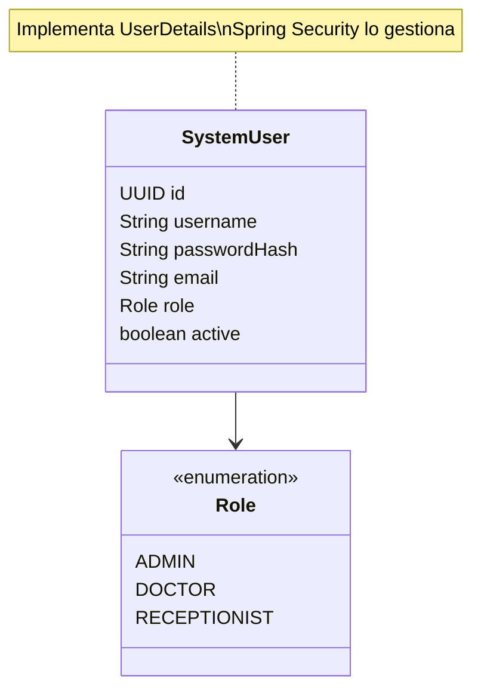
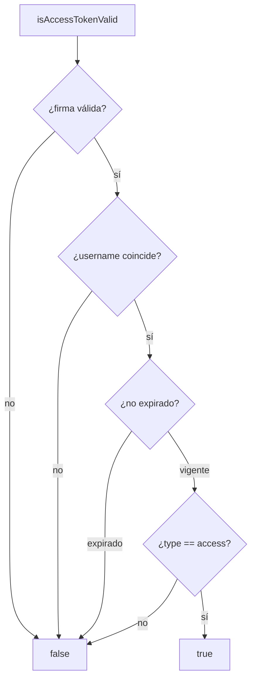
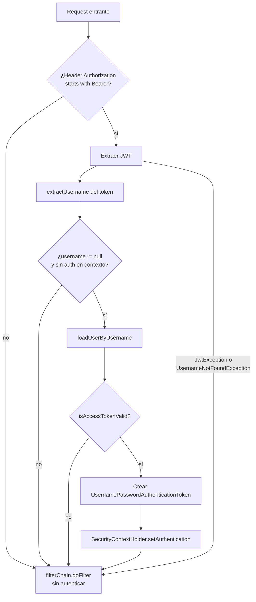
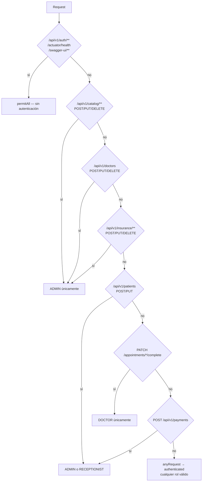
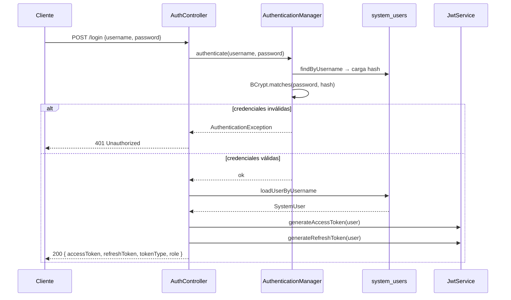
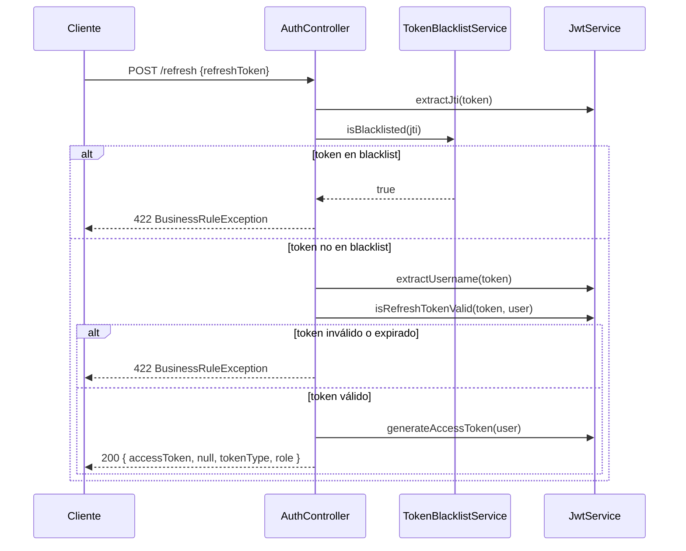
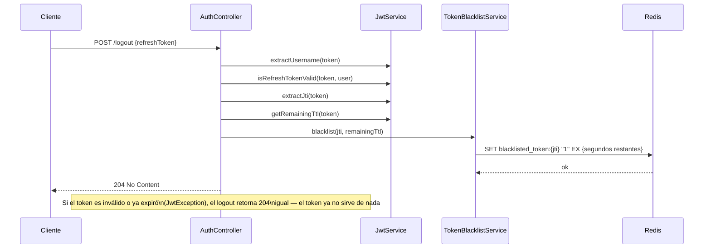
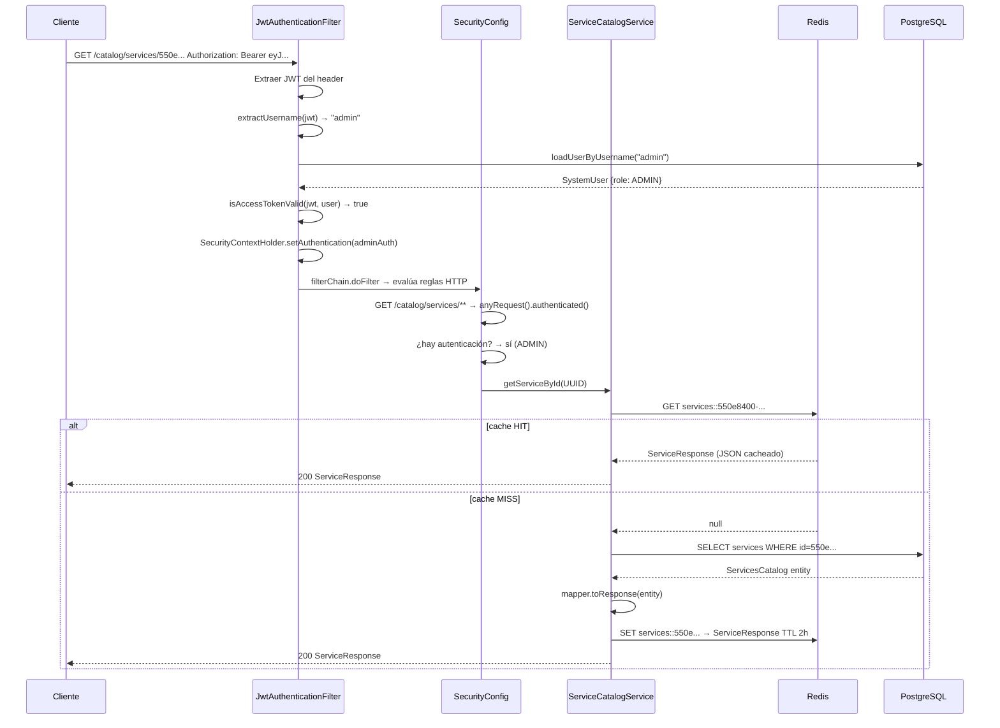
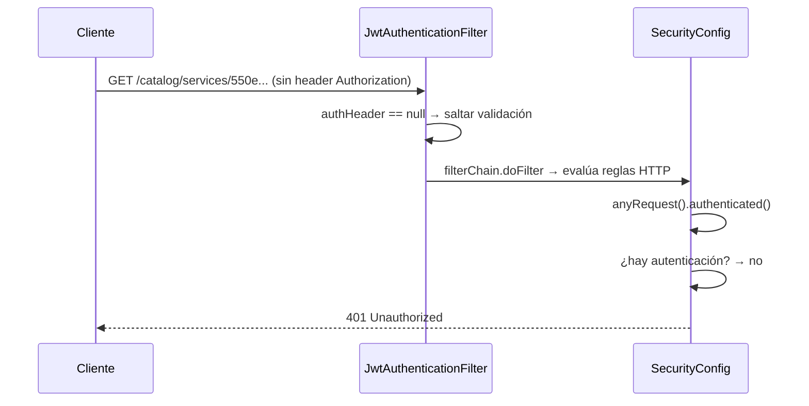

# Seguridad y Caché — Guía Completa

La capa de seguridad protege todos los recursos de la API mediante JWT stateless con tres roles de usuario. Redis cumple dos roles independientes: blacklist de tokens revocados y caché de catálogos de alta lectura.

---

## Archivos del módulo

```
security/
  Role.java                     — enum: ADMIN, DOCTOR, RECEPTIONIST
  SystemUser.java               — entidad de usuario del sistema (implementa UserDetails)
  SystemUserRepository.java     — repositorio JPA para system_users
  UserDetailsServiceImpl.java   — adaptador entre Spring Security y la BD
  JwtService.java               — generación y validación de JWT (access + refresh)
  JwtAuthenticationFilter.java  — filtro que intercepta cada request y establece autenticación
  TokenBlacklistService.java    — revocación de refresh tokens via Redis

config/
  SecurityConfig.java           — reglas de autorización HTTP y beans de seguridad
  CacheConfig.java              — RedisCacheManager con TTL por cache y serialización JSON

domain/auth/
  AuthController.java           — endpoints: /login, /refresh, /logout
  dto/
    LoginRequest.java           — { username, password }
    RefreshTokenRequest.java    — { refreshToken }
    LogoutRequest.java          — { refreshToken }
    TokenResponse.java          — { accessToken, refreshToken?, tokenType, role }
```

---

## 13.1 Modelo de Usuario del Sistema

La tabla `system_users` almacena los usuarios que pueden acceder a la API (administradores, médicos, recepcionistas). No confundir con `patients` o `doctors`, que representan datos clínicos.

### Relación entre entidades de seguridad y clínicas



### SystemUser como UserDetails

`SystemUser` implementa la interfaz `UserDetails` de Spring Security. Esto permite que Spring Security lo use directamente en el contexto de autenticación sin necesidad de un adaptador separado.

```java
@Override
public Collection<? extends GrantedAuthority> getAuthorities() {
    return List.of(new SimpleGrantedAuthority(role.name()));
    // retorna "ADMIN", "DOCTOR" o "RECEPTIONIST" como authority
}

@Override
public String getPassword() {
    return passwordHash;  // Lombok genera getPasswordHash(), pero Spring necesita getPassword()
}

@Override
public boolean isEnabled() {
    return active;  // Lombok genera isActive(), pero Spring necesita isEnabled()
}
```

Los tres métodos que retornan `true` siempre (`isAccountNonExpired`, `isAccountNonLocked`, `isCredentialsNonExpired`) delegan el control de vigencia al JWT, no a la cuenta. Esto simplifica el modelo: una cuenta se activa o desactiva con el campo `active`.

### UserDetailsServiceImpl

Actúa como puente entre Spring Security y el repositorio JPA:

```java
@Override
@Transactional(readOnly = true)
public UserDetails loadUserByUsername(String username) throws UsernameNotFoundException {
    return systemUserRepository.findByUsername(username)
            .orElseThrow(() -> new UsernameNotFoundException("Usuario no encontrado: " + username));
}
```

Spring Security invoca `loadUserByUsername` en dos momentos: durante el login (para verificar credenciales) y dentro del `JwtAuthenticationFilter` (para cargar el usuario al validar cada request).

---

## 13.2 JSON Web Tokens (JWT)

La aplicación usa **dos tipos de token** con propósitos distintos:

| Token | Duración | Propósito |
|---|---|---|
| `access` | 15 minutos (configurable) | Autenticar requests a la API |
| `refresh` | 7 días (configurable) | Obtener nuevos access tokens sin re-autenticarse |

### Estructura del payload

Cada token es un JWT firmado con HMAC-SHA256. El payload contiene:

```json
{
  "jti": "550e8400-e29b-41d4-a716-446655440000",
  "sub": "dr.garcia",
  "type": "access",
  "role": "DOCTOR",
  "iat": 1711900800,
  "exp": 1711901700
}
```

| Claim | Descripción |
|---|---|
| `jti` | JWT ID — UUID único por token. Usado para blacklisting en logout |
| `sub` | Subject — username del usuario |
| `type` | `"access"` o `"refresh"` — distingue el tipo de token |
| `role` | Rol del usuario — usado para autorización |
| `iat` | Issued At — timestamp de emisión |
| `exp` | Expiration — timestamp de expiración |

### JwtService — generación

```java
private String buildToken(UserDetails userDetails, long expirationMs, String tokenType) {
    return Jwts.builder()
            .id(UUID.randomUUID().toString())       // jti único
            .subject(userDetails.getUsername())      // sub
            .claim(CLAIM_TYPE, tokenType)            // "access" o "refresh"
            .claim("role", /* authority del usuario */)
            .issuedAt(new Date())
            .expiration(new Date(System.currentTimeMillis() + expirationMs))
            .signWith(getSignKey())                  // HMAC-SHA256
            .compact();
}
```

La clave de firma se obtiene decodificando el secreto Base64 configurado en `app.jwt.secret`. La librería `jjwt` (`io.jsonwebtoken`) se encarga de la firma y verificación.

### JwtService — validación



`isRefreshTokenValid` sigue el mismo flujo pero verifica `type == refresh`. Esta distinción evita que un refresh token se use para autenticar requests normales y viceversa.

### Métodos clave de JwtService

| Método | Descripción |
|---|---|
| `generateAccessToken(user)` | Genera access token con `expirationMs = accessTokenExpiration` |
| `generateRefreshToken(user)` | Genera refresh token con `expirationMs = refreshTokenExpiration` |
| `extractUsername(token)` | Lee el claim `sub` |
| `extractJti(token)` | Lee el claim `jti` — necesario para el blacklist de logout |
| `getRemainingTtl(token)` | Calcula `Duration` entre ahora y la expiración — necesario para el TTL del blacklist |
| `isAccessTokenValid(token, user)` | Valida firma, usuario, expiración y tipo |
| `isRefreshTokenValid(token, user)` | Igual pero verifica tipo refresh |

### Configuración en application.yml

```yaml
app:
  jwt:
    secret: <secreto-base64-256-bits>
    access-token-expiration: 900000      # 15 minutos en ms
    refresh-token-expiration: 604800000  # 7 días en ms
```

---

## 13.3 Filtro de Autenticación JWT

`JwtAuthenticationFilter` extiende `OncePerRequestFilter`, garantizando que se ejecuta exactamente una vez por request, incluso en redirecciones internas.

### Flujo del filtro



El filtro nunca rechaza por sí mismo — simplemente no establece autenticación si algo falla. Es `SecurityConfig` quien decide qué endpoints requieren autenticación y devuelve el 401 cuando el contexto está vacío.

### Por qué `OncePerRequestFilter`

Spring puede invocar el mismo filtro múltiples veces en un request si hay redirecciones internas (forward, include). `OncePerRequestFilter` garantiza una única ejecución almacenando un atributo en el request como marca.

### Posición en la cadena de filtros

```java
.addFilterBefore(jwtFilter, UsernamePasswordAuthenticationFilter.class)
```

El filtro JWT se coloca antes del `UsernamePasswordAuthenticationFilter` estándar (que procesa formularios de login). En una aplicación stateless solo el filtro JWT es relevante, pero es buena práctica mantener el orden correcto.

---

## 13.4 Configuración de Spring Security

`SecurityConfig` centraliza todas las reglas de autorización de la aplicación.

### Decisiones de diseño

**CSRF deshabilitado**: Los ataques CSRF explotan cookies de sesión. Como la aplicación es completamente stateless (sin sesiones, sin cookies), CSRF no aplica.

```java
.csrf(AbstractHttpConfigurer::disable)
.sessionManagement(sm -> sm.sessionCreationPolicy(SessionCreationPolicy.STATELESS))
```

**`@EnableMethodSecurity`**: Habilita las anotaciones `@PreAuthorize`, `@PostAuthorize` y similares para protección a nivel de método, como complemento a las reglas HTTP.

### Reglas de autorización por recurso



### Tabla de permisos por rol

| Recurso | Operación | ADMIN | DOCTOR | RECEPTIONIST |
|---|---|:---:|:---:|:---:|
| `/auth/**` | todas | ✓ | ✓ | ✓ |
| `/catalog/**` | lectura (GET) | ✓ | ✓ | ✓ |
| `/catalog/**` | escritura (POST/PUT/DELETE) | ✓ | — | — |
| `/doctors` | lectura | ✓ | ✓ | ✓ |
| `/doctors` | escritura | ✓ | — | — |
| `/insurance/**` | lectura | ✓ | ✓ | ✓ |
| `/insurance/**` | escritura | ✓ | — | — |
| `/patients` | lectura | ✓ | ✓ | ✓ |
| `/patients` | escritura | ✓ | — | ✓ |
| `/appointments/*/complete` | PATCH | — | ✓ | — |
| `/payments` | POST | ✓ | — | ✓ |
| resto de endpoints | todas | ✓ | ✓ | ✓ |

### Beans expuestos

```java
@Bean
PasswordEncoder passwordEncoder() {
    return new BCryptPasswordEncoder();
}
// BCrypt con factor de trabajo 10 (por defecto). Las contraseñas nunca se guardan en texto plano.

@Bean
AuthenticationManager authenticationManager(AuthenticationConfiguration config) throws Exception {
    return config.getAuthenticationManager();
}
// AuthenticationManager es el componente que valida credenciales en el login.
// Se expone como bean para que AuthController pueda inyectarlo.
```

---

## 13.5 Endpoints de Autenticación

### POST /api/v1/auth/login



**Request:**
```json
{ "username": "dr.garcia", "password": "secreto123" }
```

**Response 200:**
```json
{
  "accessToken": "eyJhbGc...",
  "refreshToken": "eyJhbGc...",
  "tokenType": "Bearer",
  "role": "DOCTOR"
}
```

### POST /api/v1/auth/refresh

Emite un nuevo access token sin re-autenticarse. El refresh token se mantiene igual: el cliente debe volver a hacer login cuando el refresh expire.



El endpoint verifica primero el blacklist (Redis) antes de parsear el token completo, para fallar rápido en caso de tokens revocados.

### POST /api/v1/auth/logout

Revoca el refresh token agregando su `jti` a Redis. El access token expira naturalmente en 15 minutos — riesgo aceptable para una aplicación interna.



El logout siempre retorna 204, incluso si el token es inválido. Esto evita filtrar información sobre la validez de tokens a posibles atacantes.

---

## 13.6 Revocación de Tokens con Redis (Blacklist)

`TokenBlacklistService` usa Redis como almacén efímero de tokens revocados. La clave de diseño es que las entradas se auto-eliminan cuando el token hubiera expirado naturalmente.

### Estructura de la clave en Redis

```
blacklisted_token:{jti}  →  "1"
```

El valor `"1"` es un marcador (placeholder). Lo único relevante es la existencia de la clave, no su valor. El TTL se calcula como el tiempo restante hasta la expiración del token:

```java
public void blacklist(String jti, Duration remainingTtl) {
    if (remainingTtl.isZero() || remainingTtl.isNegative()) {
        return; // el token ya expiró, Redis no necesita nada
    }
    redisTemplate.opsForValue().set(KEY_PREFIX + jti, "1", remainingTtl);
}
```

### Por qué TTL = tiempo restante del token

Si el TTL de Redis fuera mayor que la expiración del token, las entradas quedarían en Redis después de que el token dejó de ser válido — acumulando basura innecesaria.

Si el TTL fuera menor, habría una ventana donde el token todavía es válido pero ya no aparece en el blacklist — permitiendo reutilizarlo después del logout.

El TTL exacto garantiza que Redis elimine la entrada en el mismo momento en que el token expiraría, sin trabajo extra de limpieza.

### Integración con el endpoint /refresh

```java
String jti = jwtService.extractJti(token);
if (tokenBlacklistService.isBlacklisted(jti)) {
    throw new BusinessRuleException("El refresh token es invalido o ha expirado");
}
```

La verificación ocurre antes de cualquier otra validación del token. Una lookup en Redis es O(1), por lo que el overhead es mínimo.

### Template usado: StringRedisTemplate

`StringRedisTemplate` es una variante de `RedisTemplate` que serializa tanto claves como valores como `String`. Es la elección correcta aquí porque tanto `jti` como el marcador `"1"` son strings simples — no hay necesidad de serialización JSON.

---

## 13.7 Caché con Redis

Además del blacklist, Redis actúa como caché de segundo nivel para catálogos de servicios médicos, medicamentos y aseguradoras. Estos datos son de alta lectura y baja escritura, lo que los hace candidatos ideales para caching.

### CacheConfig — configuración centralizada

```java
@Configuration
@EnableCaching
public class CacheConfig {

    private GenericJacksonJsonRedisSerializer buildJsonSerializer() {
        var validator = BasicPolymorphicTypeValidator.builder()
                .allowIfBaseType(Object.class)
                .build();
        return GenericJacksonJsonRedisSerializer.create(builder -> builder
                .enableDefaultTyping(validator)
        );
    }

    @Bean
    RedisCacheManager cacheManager(RedisConnectionFactory connectionFactory) {
        RedisCacheConfiguration base = RedisCacheConfiguration.defaultCacheConfig()
                .serializeKeysWith(SerializationPair.fromSerializer(new StringRedisSerializer()))
                .serializeValuesWith(SerializationPair.fromSerializer(buildJsonSerializer()))
                .disableCachingNullValues();

        return RedisCacheManager.builder(connectionFactory)
                .withCacheConfiguration("services",          base.entryTtl(Duration.ofHours(2)))
                .withCacheConfiguration("services-list",     base.entryTtl(Duration.ofHours(2)))
                .withCacheConfiguration("medications",       base.entryTtl(Duration.ofHours(2)))
                .withCacheConfiguration("medications-list",  base.entryTtl(Duration.ofHours(2)))
                .withCacheConfiguration("insurance-providers", base.entryTtl(Duration.ofHours(1)))
                .build();
    }
}
```

### Decisiones de diseño del serializer

**`GenericJacksonJsonRedisSerializer` (Jackson 3.x / Spring Data Redis 4.0)**

En Spring Boot 4 / Spring Data Redis 4, las implementaciones anteriores (`Jackson2JsonRedisSerializer`, `GenericJackson2JsonRedisSerializer`) quedaron deprecadas. La API correcta usa `GenericJacksonJsonRedisSerializer` de `tools.jackson.databind`.

`enableDefaultTyping` con `BasicPolymorphicTypeValidator` incluye metadatos de tipo en el JSON almacenado en Redis. Esto permite deserializar correctamente aunque el tipo concreto sea una interfaz o clase genérica:

```json
// sin defaultTyping — falla al deserializar
{"id":"550e...","name":"Consulta General"}

// con defaultTyping — deserializa correctamente
["com.fepdev.sfm.backend.domain.catalog.dto.ServiceResponse",
 {"id":"550e...","name":"Consulta General"}]
```

**`disableCachingNullValues()`**: Impide cachear resultados null. Un null cacheado bloquearía futuros inserts hasta que el TTL expire, causando inconsistencias.

**Serialización de claves con `StringRedisSerializer`**: Las claves en Redis son strings legibles (ej: `services::service-id-550e8400-...`), lo que facilita inspección y debugging.

### Caches registradas

| Cache | TTL | Contenido |
|---|---|---|
| `services` | 2 horas | `ServiceResponse` individual por `id` |
| `services-list` | 2 horas | Páginas de resultados filtrados de servicios |
| `medications` | 2 horas | `MedicationResponse` individual por `id` |
| `medications-list` | 2 horas | Páginas de resultados filtrados de medicamentos |
| `insurance-providers` | 1 hora | Proveedores por id y listados paginados |

Los catálogos tienen TTL de 2 horas porque cambian raramente (el admin actualiza precios ocasionalmente). Los proveedores de seguro tienen 1 hora para reflejar cambios de estado (activación/desactivación) con más agilidad.

### Anotaciones de caché en los servicios

Spring AOP intercepta los métodos anotados y decide si consultar Redis o llamar al método real.

#### @Cacheable — lectura

```java
// En ServiceCatalogService
@Cacheable(value = "services", key = "#id")
@Transactional(readOnly = true)
public ServiceResponse getServiceById(UUID id) { ... }
```

Flujo:
1. Spring genera la clave Redis: `services::550e8400-...`
2. Si existe en Redis → retorna el valor cacheado, el método no se ejecuta
3. Si no existe → ejecuta el método, guarda el resultado en Redis y lo retorna

#### @CacheEvict — invalidación en escritura

```java
// En InsuranceService
@CacheEvict(value = "insurance-providers", allEntries = true)
@Transactional
public InsuranceProviderResponse createProvider(InsuranceProviderCreateRequest request) { ... }
```

`allEntries = true` borra todas las entradas de ese cache al escribir. Es la estrategia más simple y correcta cuando las listas filtradas son numerosas y complejas de invalidar individualmente.

#### @Caching — múltiples evictions en un solo método

Cuando un write afecta tanto el cache de entidad individual como el de listas, se agrupan con `@Caching`:

```java
// En ServiceCatalogService — invalidar individual Y lista al crear/actualizar
@Caching(evict = {
    @CacheEvict(value = "services",      allEntries = true),
    @CacheEvict(value = "services-list", allEntries = true)
})
@Transactional
public ServiceResponse createServicesCatalog(ServiceCreateRequest request) { ... }
```

`@Caching` es necesario porque Java no permite repetir la misma anotación dos veces sin un contenedor.

### Mapa completo de anotaciones de caché

```
ServiceCatalogService
  createServicesCatalog()  → @Caching evict: services + services-list
  updateServiceCatalog()   → @Caching evict: services + services-list
  deactivateService()      → @Caching evict: services + services-list
  getServiceById()         → @Cacheable "services" key=#id
  getServiceCatalogs()     → @Cacheable "services-list" key=categoria+filtros

MedicationsCatalogService
  createMedicationCatalog() → @Caching evict: medications + medications-list
  updateMedicationCatalog() → @Caching evict: medications + medications-list
  deactivateMedication()    → @Caching evict: medications + medications-list
  getMedicationById()       → @Cacheable "medications" key=#id
  getMedications()          → @Cacheable "medications-list" key=filtros

InsuranceService
  createProvider()    → @CacheEvict "insurance-providers" allEntries=true
  updateProvider()    → @CacheEvict "insurance-providers" allEntries=true
  deactivateProvider()→ @CacheEvict "insurance-providers" allEntries=true
  getProviderById()   → @Cacheable "insurance-providers" key='id-'+#id
  listProviders()     → @Cacheable "insurance-providers" key='list-'+filtros
```

---

## 13.8 Flujo Completo de una Request Autenticada

Ejemplo: `GET /api/v1/catalog/services/550e8400-...` con un access token válido.



### Flujo cuando el token falta o es inválido



---

## 13.9 Separación de Responsabilidades en Redis

Un detalle importante: Redis cumple **dos roles completamente independientes** en la aplicación, y cada uno usa su propia abstracción:

| Rol | Template usado | Tipo de datos | Gestión del TTL |
|---|---|---|---|
| Blacklist de tokens | `StringRedisTemplate` | String simple (`"1"`) | TTL = vida restante del token |
| Caché de catálogos | `RedisCacheManager` | JSON con tipo embebido | TTL fijo por cache (1–2 horas) |

`StringRedisTemplate` opera directamente sobre Redis con total control. `RedisCacheManager` abstrae Redis detrás de las anotaciones `@Cacheable`/`@CacheEvict` de Spring Cache.

Esto significa que aunque falle Redis (por ejemplo, si el servidor Redis no está disponible), el `RedisCacheManager` puede configurarse con un fallback en memoria, mientras que el blacklist de tokens simplemente no funcionará — un token revocado podría reutilizarse brevemente. Esta es una decisión de disponibilidad aceptable para la naturaleza de la aplicación.
