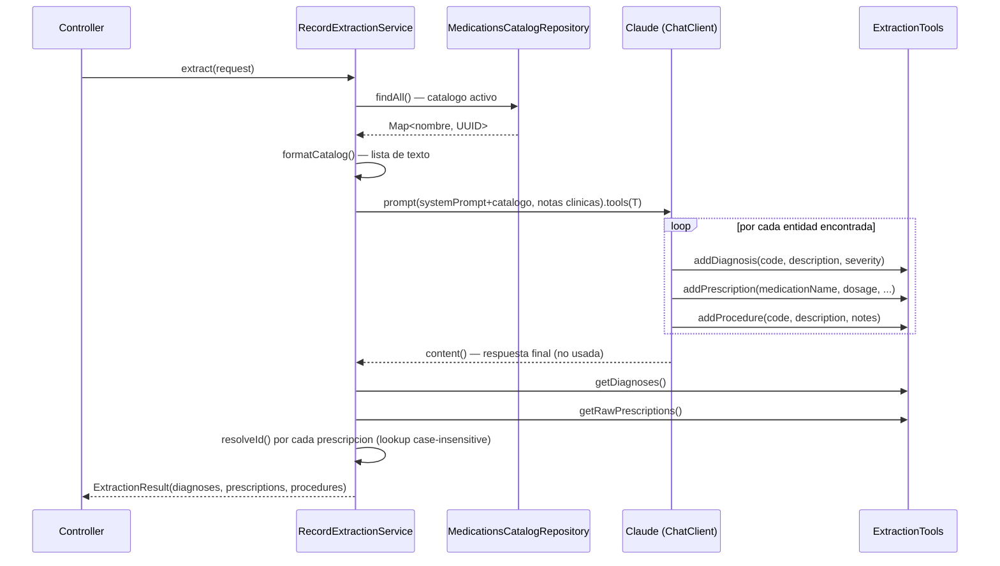

# AI P2 — Extraccion Estructurada de Notas Clinicas via Tool Calling

Endpoint: `POST /api/v1/ai/records/extract`

---

## Descripcion del problema

Cuando un medico completa una cita, escribe notas clinicas en texto libre. Para poder registrar diagnosticos, prescripciones y procedimientos en el expediente y generar items de factura correctamente, esas notas deben convertirse en entidades estructuradas con campos tipados.

La extraccion manual es propensa a errores y consume tiempo. El objetivo de esta integracion es que el medico escriba libremente y el sistema infiera automaticamente la estructura necesaria, incluyendo la resolucion de nombres de medicamentos contra el catalogo activo de la clinica.

---

## Patron utilizado: Tool Calling

Se evaluo inicialmente Structured Output (`entity()`) para extraer un solo objeto raiz con listas anidadas. Se descarto por una razon fundamental: `entity()` genera un unico JSON al final de la respuesta y no permite que el modelo vaya registrando entidades incrementalmente. Tool Calling es mas apropiado cuando el numero de entidades a extraer es variable y desconocido, ya que el modelo decide cuantas veces invocar cada herramienta segun lo que encuentra en el texto.

La consecuencia practica: para una nota con 2 diagnosticos, 1 prescripcion y 1 procedimiento, el modelo realiza 4 llamadas a herramientas; para una nota simple con un solo diagnostico, realiza 1 llamada.

---

## Arquitectura

### Clases involucradas

```
ai/extraction/
  ExtractionTools.java          — herramientas Tool Calling (state container)
  RecordExtractionService.java  — orquestacion del pipeline
  AiExtractionController.java   — endpoint REST
  dto/
    RecordExtractionRequest.java
    ExtractionResult.java
    ExtractedDiagnosis.java
    ExtractedPrescription.java
    ExtractedProcedure.java
```

### Flujo de ejecucion



---

## Implementacion

### ExtractionTools

`ExtractionTools` es un POJO instanciado por request. Actua como acumulador de estado: cada llamada del modelo a una herramienta agrega un elemento a la lista correspondiente. Al terminar la llamada LLM, el servicio lee esas listas.

```java
public class ExtractionTools {

    record RawPrescription(String medicationName, String dosage,
                           String frequency, Integer durationDays, String instructions) {}

    private final List<ExtractedDiagnosis> diagnoses = new ArrayList<>();
    private final List<RawPrescription> rawPrescriptions = new ArrayList<>();
    private final List<ExtractedProcedure> procedures = new ArrayList<>();

    @Tool(description = "Registra un diagnostico extraido de las notas clinicas. "
                      + "Llama esta funcion una vez por cada diagnostico encontrado.")
    public void addDiagnosis(String icd10Code, String description, String severity) {
        diagnoses.add(new ExtractedDiagnosis(icd10Code, description, severity));
    }

    @Tool(description = "Registra una prescripcion de medicamento. El nombre del medicamento "
                      + "debe coincidir exactamente con el catalogo provisto. "
                      + "Llama esta funcion una vez por cada medicamento prescrito.")
    public void addPrescription(String medicationName, String dosage, String frequency,
                                Integer durationDays, String instructions) {
        rawPrescriptions.add(new RawPrescription(medicationName, dosage, frequency,
                                                  durationDays, instructions));
    }

    @Tool(description = "Registra un procedimiento medico realizado. "
                      + "Llama esta funcion una vez por cada procedimiento encontrado.")
    public void addProcedure(String procedureCode, String description, String notes) {
        procedures.add(new ExtractedProcedure(procedureCode, description, notes));
    }
}
```

El objeto se construye con `new ExtractionTools()` por cada request, no como bean de Spring. Esto garantiza que las listas internas no compartan estado entre requests concurrentes.

### Resolucion de IDs de medicamentos

El modelo recibe en el system prompt la lista de nombres exactos del catalogo. Al llamar `addPrescription`, usa uno de esos nombres. Tras la llamada LLM, el servicio hace un lookup case-insensitive en el mapa `nombre -> UUID`:

```java
private UUID resolveId(String name, Map<String, UUID> map) {
    if (name == null) return null;
    return map.entrySet().stream()
            .filter(e -> e.getKey().equalsIgnoreCase(name.trim()))
            .findFirst()
            .map(Map.Entry::getValue)
            .orElse(null);
}
```

Si el modelo devuelve un nombre que no coincide con ningun entry del catalogo, `matchedMedicationId` es `null`. El consumidor del endpoint puede usar ese campo para saber si la prescripcion fue resuelta contra el catalogo o no.

### System prompt

El system prompt inyecta el catalogo de medicamentos activos como lista de texto antes de cada llamada:

```
Catalogo de medicamentos disponibles (usa EXACTAMENTE estos nombres al registrar prescripciones):
- Amoxicilina 500mg
- Ibuprofeno 400mg
- Metformina 850mg
...

Reglas:
- Extrae SOLO informacion que este explicitamente mencionada en las notas
- El nombre del medicamento debe coincidir exactamente con alguno del catalogo anterior
- La severidad de diagnosticos debe ser uno de: mild, moderate, severe, critical
- Si no encuentras entidades de un tipo, no llames esa herramienta
- Llama cada herramienta una vez por entidad encontrada
```

La regla "Si no encuentras entidades de un tipo, no llames esa herramienta" es critica: evita que el modelo genere entidades vacias o inventadas cuando el campo no aplica.

---

## DTOs

```java
// Request
public record RecordExtractionRequest(
    @NotNull UUID appointmentId,
    @NotNull UUID medicalRecordId,
    @NotBlank String clinicalNotes,
    String physicalExam,       // nullable
    String chiefComplaint      // nullable
) {}

// Response
public record ExtractionResult(
    List<ExtractedDiagnosis>    diagnoses,
    List<ExtractedPrescription> prescriptions,
    List<ExtractedProcedure>    procedures
) {}

public record ExtractedDiagnosis(
    String icd10Code,   // sugerido por el modelo, no validado contra catalogo ICD-10
    String description,
    String severity     // mild | moderate | severe | critical | null
) {}

public record ExtractedPrescription(
    String medicationName,
    UUID   matchedMedicationId,  // null si no coincide con ningun medicamento del catalogo
    String dosage,
    String frequency,
    Integer durationDays,
    String instructions
) {}

public record ExtractedProcedure(
    String procedureCode,  // puede ser null si el modelo no identifica un codigo estandar
    String description,
    String notes
) {}
```

---

## Resultados de pruebas

Se ejecutaron 7 casos de prueba con notas clinicas reales variando en complejidad. Los resultados documentados en `docs/ai-suggestion-test-cases.md` arrojaron:

- **Tasa de resolucion de UUID de medicamentos:** 96.4% (27/28 medicamentos resueltos correctamente contra el catalogo).
- **Tiempo de respuesta promedio:** 3.77 segundos.
- **Hallazgo notable:** el modelo es capaz de inferir prescripciones implicitas (por ejemplo, "se indica Metformina" sin mencionar la dosis explicitamente) y pedir al medico que complete los campos faltantes si los marca como null.

---

## Limitaciones conocidas

### Escalabilidad del catalogo en el prompt

El catalogo de medicamentos completo se inyecta en cada llamada como texto en el system prompt. Con catalogos pequenos (decenas de medicamentos) esto es eficiente. Con catalogos grandes (cientos de entradas), el prompt crece y puede afectar la latencia y el costo por token.

Alternativa no implementada: usar Tool Calling inverso, donde el modelo llama a una herramienta `searchMedication(name)` y el servicio hace el lookup en tiempo real. Esto reduce el prompt pero agrega una ronda extra de herramienta por prescripcion.

### El codigo ICD-10 sugerido no es validado

`ExtractedDiagnosis.icd10Code` es el codigo que el modelo infiere del texto. No se valida contra el catalogo CIE-10 indexado en el vector store. Para ese caso de uso existe el endpoint `POST /api/v1/ai/icd10/suggest` (P1), que hace una busqueda semantica formal. El campo `icd10Code` en la extraccion es una sugerencia orientativa.

### Sensibilidad al formato de las notas

El modelo extrae solo lo que esta explicitamente mencionado. Notas extremadamente telegraficas ("HTA, DM2, metformina") producen resultados correctos. Notas narrativas largas con ambiguedades producen ocasionalmente duplicados (dos llamadas a `addDiagnosis` para el mismo diagnostico expresado de formas distintas). La instruccion "Llama cada herramienta una vez por entidad encontrada" mitiga pero no elimina este comportamiento.

---

## Integracion con otros endpoints

El resultado de este endpoint es el punto de entrada natural para:

1. `POST /api/v1/medical-records/{id}/diagnoses` — registrar los diagnosticos extraidos.
2. `POST /api/v1/medical-records/{id}/prescriptions` — registrar las prescripciones con `matchedMedicationId`.
3. `POST /api/v1/medical-records/{id}/procedures` — registrar los procedimientos.
4. `POST /api/v1/ai/invoices/{invoiceId}/suggest-items` (P4) — los datos guardados del expediente alimentan la sugerencia de items de factura.

El flujo completo de una consulta con asistencia AI seria:

```
complete(appointment) -> ExtractionResult
    -> registrar diagnoses / prescriptions / procedures en el expediente
    -> suggest-items(invoice) -> ItemSuggestionResult
    -> add-items(invoice) con los items aprobados
```
