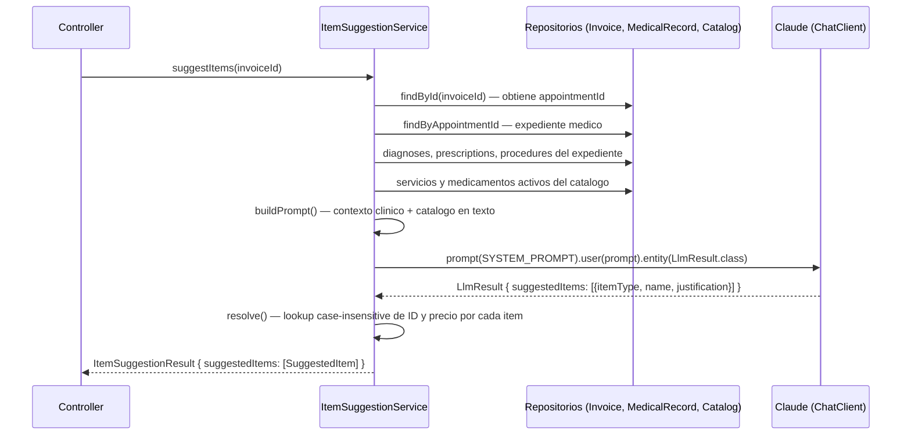
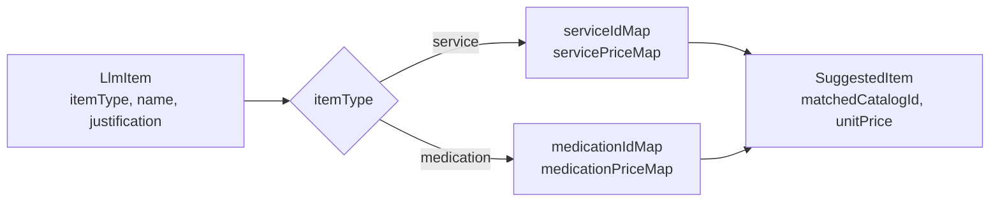
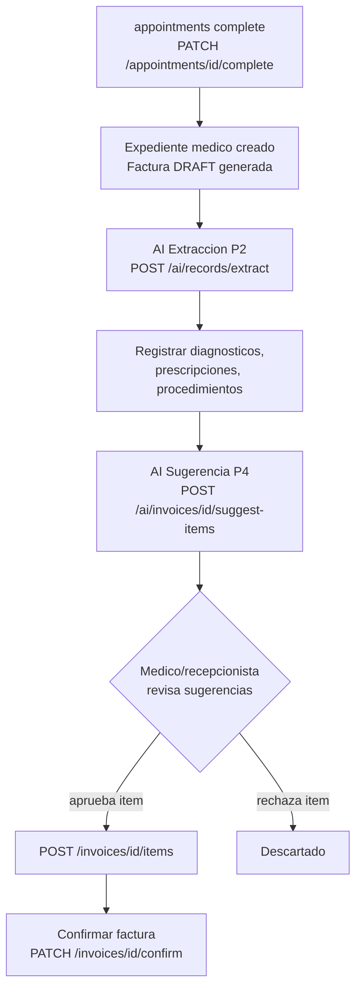

# AI P4 — Recomendacion de Items a Facturar via Structured Output

Endpoint: `POST /api/v1/ai/invoices/{id}/suggest-items`

---

## Descripcion del problema

Despues de completar una consulta, el recepcionista o medico debe construir manualmente la factura eligiendo servicios y medicamentos del catalogo. Este proceso es propenso a omisiones: una consulta con tres diagnosticos, dos prescripciones y un procedimiento puede requerir entre 4 y 8 items de factura distintos, cada uno buscado individualmente en el catalogo.

El objetivo de esta integracion es que, dado el ID de una factura en estado draft, el sistema analice el expediente medico asociado y sugiera automaticamente los items del catalogo que corresponde facturar, con su precio unitario y justificacion clinica.

---

## Patron utilizado: Structured Output

A diferencia de P2 (Tool Calling), aqui se conoce de antemano la forma exacta de la respuesta: una lista de items con campos tipados. Se utiliza `entity(LlmResult.class)` de Spring AI, que instruye al modelo para que devuelva un JSON con el schema derivado del record Java.

La eleccion entre Tool Calling y Structured Output en este contexto:

| Criterio | Tool Calling (P2) | Structured Output (P4) |
|---|---|---|
| Numero de entidades a extraer | Variable, desconocido | Variable pero homogeneo |
| Tipo de entidades | Heterogeneo (diagnosis, prescription, procedure) | Homogeneo (todos son SuggestedItem) |
| Necesidad de acumulacion incremental | Si | No |
| Patron mas directo | Tool Calling | entity() |

En P4 todas las sugerencias son del mismo tipo (`SuggestedItem`), por lo que un JSON con una lista es suficiente. No hay razon para delegar la acumulacion al modelo via herramientas.

---

## Arquitectura

### Clases involucradas

```
ai/suggestion/
  ItemSuggestionService.java        — orquestacion del pipeline
  AiItemSuggestionController.java   — endpoint REST
  dto/
    ItemSuggestionResult.java
    SuggestedItem.java
```

### Flujo de ejecucion



### Resolucion de IDs y precios post-LLM

El modelo devuelve solo `itemType`, `name` y `justification`. El servicio resuelve `matchedCatalogId` y `unitPrice` mediante lookup case-insensitive en mapas construidos antes de la llamada LLM, identico al patron de P2 para medicamentos:



Si el nombre devuelto por el modelo no coincide con ninguna entrada del catalogo, `matchedCatalogId` y `unitPrice` son `null`. Esto permite al frontend distinguir items resueltos de items que requieren seleccion manual.

---

## Implementacion

### Records internos para Structured Output

Spring AI deriva el schema JSON del record usado en `entity()`. Se definen como records privados dentro del servicio para que no sean parte del API publica:

```java
private record LlmItem(String itemType, String name, String justification) {}
private record LlmResult(List<LlmItem> suggestedItems) {}
```

`LlmResult` es el objeto raiz que el modelo debe devolver. `LlmItem` contiene solo los campos que el modelo puede determinar; los campos dependientes del catalogo (`matchedCatalogId`, `unitPrice`) se resuelven en el servicio.

### Construccion del prompt de usuario

El metodo `buildPrompt()` construye un documento de texto estructurado con dos secciones: el contexto clinico de la cita y el catalogo disponible. El modelo recibe toda la informacion necesaria en un unico prompt:

```
## Contexto clinico de la cita

**Diagnosticos:**
- I10: Hipertension esencial (primaria) (moderate)
- E11.9: Diabetes mellitus tipo 2 sin complicaciones (mild)

**Prescripciones:**
- Metformina 850mg, 1 tableta con las comidas, frecuencia: cada 8 horas

**Procedimientos realizados:**
- Electrocardiograma de reposo

## Catalogo de servicios disponibles
- Consulta General | $50.00
- Electrocardiograma | $80.00
- Perfil Lipidico | $35.00
...

## Catalogo de medicamentos disponibles
- Metformina 850mg | $12.00
- Enalapril 10mg | $8.50
...

Sugiere los items del catalogo que corresponden facturar para esta cita.
```

La inclusion del precio en el catalogo es solo orientativa para el modelo; el precio real que se incluye en `SuggestedItem` proviene del mapa construido desde la base de datos, nunca del texto devuelto por el modelo.

### System prompt

```
Eres un asistente de facturacion medica. Tu tarea es sugerir los servicios y medicamentos
a incluir en una factura, basandote en el contexto clinico de la cita.

Reglas:
- Usa EXACTAMENTE los nombres del catalogo provisto
- Sugiere solo items clinicamente justificados por el contexto
- No inventes servicios ni medicamentos que no esten en el catalogo
- Maximo 8 items sugeridos
- El campo itemType debe ser "service" o "medication"
```

La restriccion "Usa EXACTAMENTE los nombres del catalogo" es la que permite que el lookup posterior funcione. Sin ella, el modelo podria devolver variantes del nombre ("Metformina" en lugar de "Metformina 850mg") que romperian la resolucion case-insensitive.

### Transaccionalidad

El metodo `suggestItems()` esta anotado con `@Transactional(readOnly = true)`. Todas las consultas a repositorios ocurren dentro de la misma sesion Hibernate, evitando multiples aperturas de conexion. La llamada LLM ocurre dentro de la transaccion pero no la afecta porque no hay operaciones de escritura.

---

## DTOs

```java
// Response del endpoint
public record ItemSuggestionResult(List<SuggestedItem> suggestedItems) {}

public record SuggestedItem(
    String     itemType,          // "service" o "medication"
    String     name,              // nombre exacto del catalogo
    UUID       matchedCatalogId,  // null si no se resolvio contra el catalogo
    BigDecimal unitPrice,         // null si no se resolvio
    String     justification      // razon clinica de la sugerencia
) {}
```

---

## Resultados de pruebas

Se ejecutaron 5 casos de prueba con expedientes clinicos reales de distinta complejidad, documentados en `docs/ai-suggestion-test-cases.md`. Resultados:

- **Resolucion de UUID:** 96.4% de los items sugeridos fueron resueltos correctamente contra el catalogo (matchedCatalogId no nulo).
- **Tiempo de respuesta promedio:** 3.77 segundos.
- **Precision clinica:** el modelo no invento items fuera del catalogo en ninguno de los casos. En casos con catalogo parcialmente relevante, eligio los servicios mas proximos disponibles.
- **Limite de 8 items respetado:** en todos los casos el modelo se mantuvo dentro del limite declarado en el system prompt.

---

## Limitaciones conocidas

### Escalabilidad del catalogo en el prompt

Al igual que en P2, ambos catalogos completos (servicios y medicamentos) se inyectan en cada llamada. Con catalogos de decenas de entradas el impacto es bajo. Con catalogos de cientos de entradas el prompt puede crecer significativamente. La alternativa seria filtrar el catalogo antes de enviarlo (por categoria o por relevancia semantica respecto a los diagnosticos), pero no esta implementada.

### Dependencia del estado del expediente

Si `suggestItems()` se llama antes de que el expediente tenga diagnosticos, prescripciones o procedimientos registrados, el contexto clinico que recibe el modelo es vacio y la calidad de las sugerencias degrada. El endpoint no valida que el expediente este completo; es responsabilidad del consumidor llamarlo en el momento adecuado del flujo.

### La justificacion no es verificada

El campo `justification` es texto libre generado por el modelo. No se valida ni sanitiza. Para uso interno es util como referencia al medico o recepcionista; no debe mostrarse al paciente sin revision.

### Sin deduplicacion contra items ya existentes en la factura

Si la factura ya tiene items agregados manualmente, el endpoint puede sugerir los mismos items de nuevo. No hay consulta a los items actuales de la factura antes de generar sugerencias. El consumidor debe filtrar duplicados en el frontend.

---

## Posicion en el flujo clinico



P4 consume los datos ya guardados por P2 en el expediente. Llamar P4 inmediatamente despues de P2 (sin guardar el expediente) produce sugerencias de baja calidad porque el contexto clinico aun no esta en la base de datos.
