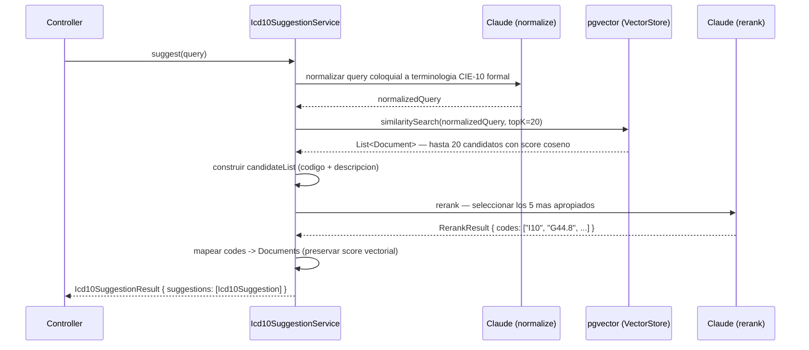

# AI P1 — Sugerencia de Codigos ICD-10 via RAG

Endpoint: `POST /api/v1/ai/icd10/suggest`

---

## Descripcion del problema

Al registrar un diagnostico en el expediente medico, el medico debe seleccionar un codigo ICD-10 (CIE-10 en espanol) del catalogo oficial, que contiene mas de 14,000 entradas con terminologia medica formal. En la practica, los medicos describen las condiciones en lenguaje coloquial: "azucar alta", "derrame cerebral", "se quebro la cadera". Este lenguaje no coincide lexicamente con las descripciones oficiales del catalogo ("Diabetes mellitus no insulinodependiente sin mencion de complicacion", "Accidente vascular encefalico agudo"), lo que hace inviable una busqueda por palabras clave directa.

El objetivo es que el medico escriba en lenguaje libre y el sistema devuelva los 5 codigos ICD-10 mas relevantes en orden de pertinencia clinica.

---

## Infraestructura

### Modelo de embedding

Se utiliza `nomic-embed-text` corriendo localmente via Ollama (sin costo por token, sin dependencia de red externa para embeddings). Genera vectores de 768 dimensiones.

Limitacion relevante documentada durante el desarrollo: `nomic-embed-text` esta optimizado para ingles. Textos en espanol producen representaciones semanticas menos precisas que en ingles, lo que agrava el problema del vocabulary mismatch descrito mas adelante.

### Vector store: pgvector

La misma instancia PostgreSQL del proyecto aloja la extension `vector` de pgvector. Se agregaron dos migraciones Flyway:

- **V10** — habilita la extension:
  ```sql
  CREATE EXTENSION IF NOT EXISTS vector;
  ```
  Requiere la imagen Docker `pgvector/pgvector:pg15` en lugar de `postgres:15-alpine`, que no incluye la extension.

- **V11** — crea la tabla y el indice:
  ```sql
  CREATE TABLE IF NOT EXISTS vector_store (
      id        UUID    NOT NULL DEFAULT gen_random_uuid() PRIMARY KEY,
      content   TEXT,
      metadata  JSONB,
      embedding vector(768)
  );

  CREATE INDEX IF NOT EXISTS vector_store_hnsw_idx
      ON vector_store USING hnsw (embedding vector_cosine_ops);
  ```
  El indice HNSW con distancia coseno es el apropiado para busqueda semantica sobre vectores normalizados. Se gestiona via Flyway (`initialize-schema: false` en la config de Spring AI) para mantener coherencia con el resto del esquema.

### Carga del catalogo CIE-10

`Icd10DataLoader` se ejecuta de forma asincrona al iniciar la aplicacion (listener de `ApplicationReadyEvent`). Si el vector store ya tiene datos, omite la carga. Si esta vacio, lee `data/cie-10.csv` y carga los 14,268 codigos de nivel 2 a 5 en batches de 50.

El CSV se ubica en `src/main/resources/data/` y no en `static/` para que Spring Boot no lo exponga como recurso HTTP estatico.

Formato del documento indexado: `content = description`, `metadata = {"code": "I10"}`. El texto indexado es la descripcion oficial CIE-10 en espanol.

---

## Arquitectura del pipeline

El pipeline tiene tres pasos secuenciales, todos implementados en `Icd10SuggestionService`:



### Paso 1 — Normalizacion (query expansion)

Claude recibe la descripcion coloquial y la convierte a terminologia medica formal equivalente a la que apareceria en el catalogo CIE-10. Este paso resuelve el vocabulary mismatch entre el lenguaje del medico y el lenguaje del catalogo.

### Paso 2 — Busqueda vectorial

La query normalizada se convierte en embedding (nomic-embed-text via Ollama) y se buscan los documentos mas similares en pgvector por distancia coseno. Se recuperan hasta 20 candidatos.

### Paso 3 — Reranking

Claude recibe la descripcion original, la query normalizada y la lista de candidatos con sus descripciones. Selecciona los 5 codigos mas apropiados clinicamente en orden de relevancia. Este paso permite corregir los errores de ranking del vector search, que ordena por similitud semantica geometrica y no por pertinencia clinica.

---

## Iteraciones del desarrollo

Esta integracion requirio cuatro iteraciones significativas antes de alcanzar los resultados actuales. Se documentan en orden cronologico porque cada una revela una capa distinta del problema.

---

### Iteracion 1 — Vector search puro (topK=5)

**Implementacion inicial:** la query del medico se convierte directamente en embedding y se buscan los 5 documentos mas similares. Sin ningun paso de LLM.

**Problema detectado:** la query `"hipertension arterial con cefalea"` devuelvia I77.x (Otros trastornos arteriales) y G44.x (sindromes de cefalea), pero no I10 (Hipertension esencial primaria). El codigo mas importante para esta consulta no aparecia.

**Causa raiz:** el modelo de embedding `nomic-embed-text` asigno demasiado peso al termino "arterial". La descripcion oficial de I10 es "Hipertension esencial (primaria)" y no contiene la palabra "arterial". Los vectores de "hipertension arterial" y "Hipertension esencial (primaria)" no son suficientemente proximos en el espacio de embedding del modelo, que esta optimizado para ingles.

**Conclusion:** el vector search puro es insuficiente cuando el vocabulario del usuario y el vocabulario del catalogo son distintos. La brecha no se resuelve aumentando el numero de candidatos — I10 nunca entraria al pool de los 5 mas similares a esa query.

---

### Iteracion 2 — Reranking con topK=10 y topK=25

**Implementacion:** se agrego un segundo paso de LLM que recibe los candidatos del vector search y los reordena por relevancia clinica. Se probo primero con topK=10 y luego con topK=25, esperando que al ampliar el pool I10 apareciera y Claude lo pudiera rankear primero.

**Resultado con topK=10:** I10 seguia sin aparecer entre los 10 candidatos del vector search. El reranking de Claude no tenia efecto porque el codigo buscado nunca llegaba a su lista de entrada.

**Resultado con topK=25:** identico. Con 25 candidatos recuperados, I10 seguia fuera del pool. El problema no era el tamano del pool sino la calidad de la normalizacion de la query antes de la busqueda.

**Conclusion:** el reranking es una herramienta de ordenacion, no de descubrimiento. No puede traer al ranking un codigo que el vector search no recupero. El problema debia resolverse antes de la busqueda vectorial, no despues.

---

### Iteracion 3 — Plan de enriquecimiento con sinonimos (descartado)

**Enfoque considerado:** enriquecer el texto indexado de cada codigo con sinonimos coloquiales antes de generar el embedding. El texto indexado de I10 pasaria de ser "Hipertension esencial (primaria)" a "Hipertension esencial (primaria) | hipertension arterial | presion alta | HTA | tension alta". Con la query coloquial del medico alineada con los sinonimos, el vector search recuperaria I10.

**Por que se descarto:** generar sinonimos de calidad para los 14,268 codigos del catalogo requeria una ronda de generacion con LLM por cada codigo o por batches, lo que representa un volumen de trabajo que no se podia automatizar de forma fiable en el plazo disponible. La re-indexacion del vector store completo tras la generacion anadio complejidad operativa adicional. Se mantuvo como alternativa pendiente.

---

### Iteracion 4 — Query expansion (solucion adoptada)

**Implementacion:** se agrego un primer paso al pipeline: antes de la busqueda vectorial, Claude normaliza la query coloquial a la terminologia formal que usaria el catalogo CIE-10.

- Query original: `"hipertension arterial con cefalea"`
- Query normalizada por Claude: `"Hipertension esencial (primaria), cefalea tensional"`

Con la query normalizada, el embedding de "Hipertension esencial (primaria)" es mucho mas proximo al embedding de la descripcion de I10 en el catalogo, y el codigo entra al pool de candidatos.

**Resultado:** I10 aparecio como #1 en el ranking final. El caso de referencia que habia fallado en todas las iteraciones anteriores quedo resuelto.

**Por que funciona:** la query expansion invierte la direccion del problema. En lugar de enriquecer los 14,268 documentos indexados (costoso, operacion de una vez), se enriquece cada query en tiempo real (una llamada LLM por request). El costo es latencia adicional por request (~0.5-1s por la llamada de normalizacion), pero el problema de fondo queda resuelto de forma generalizable.

El prompt de normalizacion evolucion en las siguientes iteraciones hasta su version actual:

```
Convierte la descripcion clinica a terminologia medica formal CIE-10.
Incluye TODAS las condiciones, diagnosticos y sintomas mencionados.
Omite unicamente el mecanismo accidental de como ocurrio una lesion
(caidas, golpes, accidentes vehiculares).
No omitas diagnosticos activos.
Devuelve solo la version normalizada, sin explicaciones.
```

La evolucion de este prompt se detalla en la seccion siguiente.

---

## Iteraciones del prompt de normalizacion

Una vez establecida la query expansion como solucion, el prompt de normalizacion requirio tres versiones antes de estabilizarse.

---

### Prompt v1 — Normalizacion basica

```
Eres experto en codificacion CIE-10. El medico escribio una descripcion clinica en lenguaje coloquial.
Reescribela usando la terminologia medica formal que apareceria en un catalogo CIE-10.
Manten todas las condiciones mencionadas. Devuelve solo la version normalizada, sin explicaciones.
```

**Problema:** con este prompt, la query `"se cayo y se quebro la cadera, adulto mayor"` producia una normalizacion que derivaba en traumatismos genericos. El resultado mas llamativo: V91 (Accidente de embarcacion que causa otros tipos de traumatismo) aparecia en el top-5. El modelo de embedding interpreto la caida como un "accidente" y lo asocio con codigos de accidentes de transporte y vehiculos.

El codigo esperado, S72.0 (Fractura del cuello de femur), no aparecia.

---

### Prompt v2 — Instruccion de ignorar mecanismo (provoca regresion)

Se anadi la instruccion:

```
Ignora el mecanismo de como ocurrio la lesion o el contexto situacional.
Devuelve solo el diagnostico resultante.
```

**Resultado en C7:** V91 desaparecio. Pero S72.0 seguia ausente — la normalizacion producia "traumatismo de cadera" en lugar de "fractura del cuello de femur". El resultado mejoro de ❌ total a ⚠️ parcial.

**Regresion en C1:** la query `"hipertension arterial con cefalea"` dejo de devolver I10. La instruccion "ignora el contexto situacional" fue demasiado amplia: Claude interpreto "hipertension arterial" como contexto de la cefalea y lo descarto, devolviendo solo codigos G44.x (sindromes de cefalea). El caso de referencia que habia tardado tres iteraciones en resolver regresinoo.

**Causa raiz:** la instruccion no distinguia entre mecanismo accidental ("se cayo") y diagnostico activo ("hipertension arterial"). Ambos fueron tratados como "contexto a ignorar".

---

### Prompt v3 — Instruccion quirurgica (version actual)

```
Convierte la descripcion clinica a terminologia medica formal CIE-10.
Incluye TODAS las condiciones, diagnosticos y sintomas mencionados.
Omite unicamente el mecanismo accidental de como ocurrio una lesion
(caidas, golpes, accidentes vehiculares).
No omitas diagnosticos activos.
Devuelve solo la version normalizada, sin explicaciones.
```

La diferencia respecto a v2: la instruccion de omision es explicita sobre lo que debe omitir (mecanismos accidentales con ejemplos concretos) y explicita sobre lo que no debe omitir (diagnosticos activos). Esta especificidad elimina la ambiguedad que causo la regresion.

**Resultados tras el prompt v3:**
- C1 (hipertension + cefalea): I10 #1 — regresion resuelta.
- C7 (fractura cadera): S72.0 (Fractura del cuello de femur) #1, M80.9 (Osteoporosis con fractura patologica) #2 — resultado clinicamente correcto.
- C6 (ansiedad + tristeza): F41.1 (Trastorno de ansiedad generalizada) aparece en #2 por primera vez — el prompt "Incluye TODAS las condiciones" forzó que el modelo incluyera ansiedad ademas de depresion en la normalizacion.
- C10 (fiebre, tos seca, dificultad para respirar): J06.9 y J22 en top-2 — el prompt corrigio la normalizacion incorrecta que producia "sindrome seco / boca seca" desde "tos seca".

---

## Iteracion de configuracion: topK

El valor de topK evolucion junto con las iteraciones del prompt:

| Iteracion | topK | Razon |
|---|---|---|
| v1 vector puro | 5 | Valor inicial |
| v2 + reranking | 10 | Ampliar pool para reranking |
| v3 + reranking | 25 | Intentar que I10 entrara — sin exito |
| v4 query expansion | 10 | Pool suficiente con query normalizada |
| v4 + fix C5 | 20 | N39.0 (subcódigo de ITU) no entraba con topK=10 |

El incremento a 20 fue determinante para C5 (Infeccion de vias urinarias). El codigo N39.0 es un subcódigo de N39 con descripcion ligeramente distinta. Con topK=10, solo el codigo padre N39 entraba al pool; N39.0 quedaba fuera. Con topK=20, ambos entraban y Claude seleccionaba N39.0 en #1 por ser mas especifico.

---

## Bug: lista vacia en queries de sintomas multiples

**Sintoma:** la query `"fiebre, tos seca y dificultad para respirar"` devolvia `{"suggestions": []}`.

**Causa:** `entity(RerankResult.class)` de Spring AI fallo silenciosamente al deserializar la respuesta de Claude para esta query. El modelo produjo un formato de respuesta que el deserializador no pudo mapear al record `RerankResult(List<String> codes)`. El resultado fue `reranked == null`, y el codigo original retornaba lista vacia.

**Solucion:** se agrego un fallback que, cuando el reranking retorna null o vacio, devuelve directamente los top-5 del vector search en lugar de lista vacia:

```java
if (reranked == null || reranked.codes() == null || reranked.codes().isEmpty()) {
    log.warn("Reranking retorno vacio — query='{}' normalizada='{}' — usando candidatos del vector search como fallback",
            query, normalizedQuery);
    List<Icd10Suggestion> fallback = candidates.stream()
            .map(doc -> new Icd10Suggestion(
                    (String) doc.getMetadata().get("code"),
                    doc.getText(),
                    doc.getScore()))
            .limit(5)
            .toList();
    return new Icd10SuggestionResult(fallback);
}
```

Se agrego logging adicional para diagnosticar casos futuros:
- `log.debug` con la query original y la query normalizada, visible al activar nivel DEBUG en el paquete `ai`.
- `log.warn` cuando un codigo del reranking no esta en el mapa de candidatos del vector search (indica que el modelo invento un codigo).

---

## Estado final y resultado de pruebas

Pipeline final: normalizacion (Claude, prompt v3) → vector search (topK=20, nomic-embed-text, pgvector HNSW coseno) → reranking (Claude).

Resultados sobre 10 casos de prueba documentados en `docs/ai-icd10-test-cases.md`:

| Resultado | Casos | Detalle |
|---|---|---|
| Correcto | 8/10 | C1, C3, C4, C5, C6, C7, C8, C10 |
| Parcial | 1/10 | C2 — E14.9 en lugar de E11.9 (mismo dominio, menor especificidad) |
| Fallo estructural | 1/10 | C9 — lumbago (M54.5) no recuperable semanticamente con nomic-embed-text en espanol |

El caso C9 (dolor lumbar / lumbago) es el unico fallo sin solucion en el stack actual. El termino "lumbago" existe en el catalogo CIE-10 como descripcion del codigo M54.5, pero `nomic-embed-text` no produce una representacion semantica suficientemente proxima desde lenguaje espanol coloquial. La solucion requeriria enriquecimiento de sinonimos en el indice (iteracion 3, descartada) o un modelo de embedding entrenado en espanol medico.

---

## Limitaciones conocidas

### Dependencia de calidad del embedding en espanol

`nomic-embed-text` no tiene entrenamiento especifico en espanol medico. Funciona por transferencia semantica desde ingles, lo que produce resultados aceptables para terminos con cognados directos (hipertension, diabetes, infarto) pero falla en terminologia sin equivalente obvio o en jerga coloquial local.

### Latencia acumulada del pipeline de dos llamadas LLM

Cada request realiza dos llamadas a Claude: normalizacion y reranking. El tiempo de respuesta promedio es de 2-4 segundos. En el contexto de un sistema de asistencia al medico durante la consulta, esta latencia es aceptable. Para uso en tiempo real estricto (autocompletado mientras se escribe) seria necesario optimizar, por ejemplo fusionando ambas llamadas en una sola.

### El score devuelto es el del vector search, no del reranking

`Icd10Suggestion.score` refleja la similitud coseno del vector search original, no la posicion en el reranking de Claude. Un codigo en posicion #1 del resultado final puede tener un score vectorial mas bajo que un codigo en posicion #3. El score es util como referencia de la busqueda semantica pero no como medida de confianza del resultado final.
