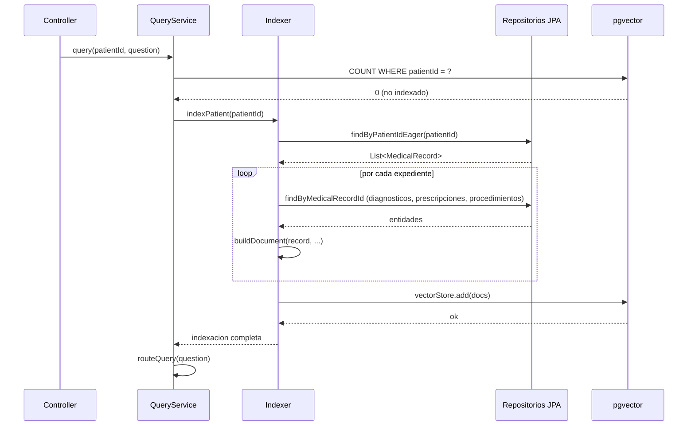
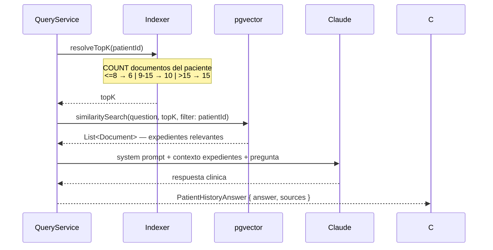
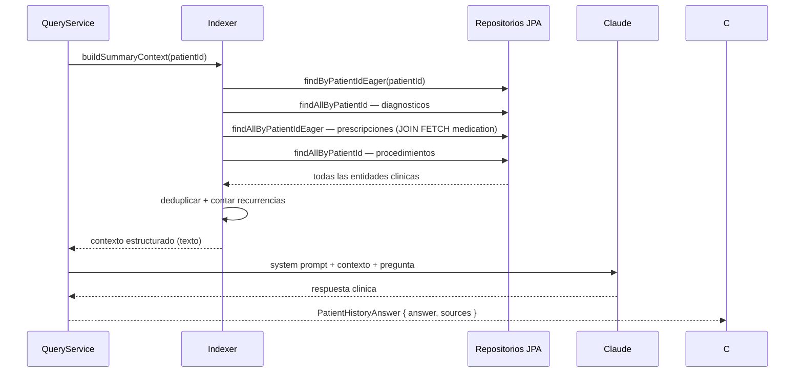

# AI P3 — Consulta en Lenguaje Natural sobre Historial del Paciente

Endpoint: `POST /api/v1/ai/patients/{patientId}/query`

---

## Descripcion del problema

El historial clinico de un paciente puede abarcar decenas de expedientes distribuidos a lo largo de anos, cada uno con notas libres, diagnosticos ICD-10, prescripciones y procedimientos. Recuperar informacion especifica de ese historial requiere hoy que el medico busque manualmente en la lista de expedientes y lea cada uno.

El objetivo es que el medico haga una pregunta en lenguaje natural ("?Tiene antecedentes de hipertension arterial?", "?Que medicamentos ha tomado para la diabetes?", "?Cuales son sus condiciones cronicas?") y reciba una respuesta fundamentada en los expedientes reales del paciente, sin inventar informacion que no este documentada.

---

## Infraestructura compartida

El vector store es la misma tabla `vector_store` de pgvector que usa P1 (sugerencia de codigos ICD-10). Los documentos del historial del paciente y los documentos del catalogo CIE-10 coexisten en la misma tabla. El aislamiento se garantiza via metadata filtering en cada busqueda:

- Documentos de historial: `metadata = {patientId: "...", medicalRecordId: "...", recordDate: "..."}`
- Documentos CIE-10: `metadata = {code: "I10"}` — no tienen `patientId`

El filtro `filterExpression("patientId == '" + patientId + "'")` en `SearchRequest` excluye naturalmente los documentos CIE-10 sin configuracion adicional.

---

## Arquitectura general

```mermaid
graph TB
    subgraph "Request"
        R[POST /ai/patients/{id}/query]
    end

    subgraph "PatientHistoryQueryService"
        V[Validar paciente]
        I[isPatientIndexed]
        IDX[indexPatient — on demand]
        CLS[isSummaryQuery]
        RA[Ruta A: queryWithVectorSearch]
        RB[Ruta B: queryWithStructuredContext]
    end

    subgraph "PatientHistoryIndexer"
        BUILD[buildDocument por expediente]
        VSADD[vectorStore.add]
        SUMCTX[buildSummaryContext — 4 queries BD]
        REIDX[reindexRecord — post-commit]
    end

    subgraph "Infraestructura"
        VS[(pgvector vector_store)]
        BD[(PostgreSQL — MedicalRecord, Diagnosis, Prescription, Procedure)]
        LLM[Claude — ChatClient]
    end

    R --> V --> I
    I -- no indexado --> IDX --> BUILD --> VSADD --> VS
    I -- ya indexado --> CLS
    IDX --> CLS
    CLS -- query especifica --> RA
    CLS -- query de resumen --> RB
    RA --> VS
    RA --> LLM
    RB --> SUMCTX --> BD
    RB --> LLM
```

---

## Indexacion on-demand

### Primera consulta por paciente

El primer query de cualquier paciente dispara la indexacion sincrona de todos sus expedientes antes de responder. El medico paga este costo una sola vez; queries subsiguientes van directo al vector store.



### Documento indexado por expediente

Cada `MedicalRecord` genera un `Document` de Spring AI con el siguiente contenido de texto:

```
Fecha: 2026-01-26
Notas clinicas: Paciente acude por...
Examen fisico: TA 140/90 mmHg...
Diagnosticos:
- I10.X: Hipertension arterial no especificada [MILD]
Prescripciones:
- Amlodipino — 5mg, cada 24 horas, 30 dias
Procedimientos:
- 71046: Radiografia de torax, 2 vistas
```

Metadata del documento: `{patientId, medicalRecordId, recordDate}`.

La construccion de cada documento requiere cuatro repositorios. Para evitar `LazyInitializationException` al acceder fuera de sesion JPA, todos usan queries con `JOIN FETCH`:

- `MedicalRecordRepository.findByPatientIdEager` — JOIN FETCH patient
- `PrescriptionRepository.findAllByMedicalRecordIdEager` — JOIN FETCH medication
- `DiagnosisRepository.findByMedicalRecordId` — sin join (campos simples)
- `ProcedureRepository.findAllByMedicalRecordId` — sin join (campos simples)

### Re-indexacion automatica post-commit

Cuando se agrega o modifica contenido clinico (diagnostico, prescripcion, procedimiento), el expediente afectado se re-indexa automaticamente sin intervencion del medico:

```java
// En DiagnosisService, PrescriptionService, ProcedureService — tras cada save:
historyIndexer.scheduleReindex(medicalRecord.getId());

// En PatientHistoryIndexer:
public void scheduleReindex(UUID medicalRecordId) {
    TransactionSynchronizationManager.registerSynchronization(new TransactionSynchronization() {
        @Override
        public void afterCommit() {
            CompletableFuture.runAsync(() -> reindexRecord(medicalRecordId));
        }
    });
}
```

El `afterCommit` garantiza que la re-indexacion lee el estado final ya persistido en BD. La ejecucion asincrona via `CompletableFuture.runAsync` no bloquea la respuesta HTTP del servicio de dominio.

`reindexRecord` elimina el documento existente por `medicalRecordId` antes de indexar el nuevo estado:

```sql
DELETE FROM vector_store WHERE metadata->>'medicalRecordId' = ?
```

---

## Clasificacion de intencion: Ruta A vs. Ruta B

Segun la naturaleza de la pregunta, el servicio enruta a una de dos arquitecturas de recuperacion. La clasificacion es determinista (sin LLM): compara la pregunta normalizada contra 44 patrones de texto.

### Normalizacion unicode

```java
String normalized = Normalizer
    .normalize(question.toLowerCase(), Normalizer.Form.NFD)
    .replaceAll("\\p{InCombiningDiacriticalMarks}", "");
```

La descomposicion NFD separa el caracter base del diacritico (e.g. "o" + combining grave), que luego se elimina con la clase unicode `InCombiningDiacriticalMarks`. El medico puede escribir con o sin acentos y la clasificacion funciona igual.

### Patrones de resumen (Ruta B)

Los 44 patrones cubren ocho categorias semanticas:

| Categoria | Ejemplos de patron |
|---|---|
| Resumen y perfil explícito | `historial completo`, `resumen medico`, `perfil de salud` |
| "Todos/todas" + entidad | `todos los diagnosticos`, `todos los medicamentos` |
| "Que" + entidad plural | `que diagnosticos`, `que enfermedades`, `que medicamentos` |
| "Cuales son" + entidad | `cuales son sus diagnosticos`, `cuales son las condiciones` |
| Antecedentes amplios | `antecedentes medicos`, `antecedentes patologicos` |
| Condiciones cronicas/conocidas | `condiciones cronicas`, `enfermedades conocidas` |
| Lista / listado explícito | `lista de diagnosticos`, `listado de procedimientos` |
| Frases naturales de resumen | `enfermedades que padece`, `medicamentos que toma` |

Si la pregunta contiene algun patron (substring match sobre la query normalizada), se activa la Ruta B.

---

## Ruta A — Vector search con topK dinamico

Para preguntas especificas sobre condiciones, medicamentos o fechas concretas.



### topK dinamico

El topK fijo de 6 es suficiente para pacientes con pocos expedientes pero insuficiente para historiales amplios. El topK dinamico escala con el volumen indexado:

| Documentos indexados | topK aplicado |
|---|---|
| <= 8 | 6 |
| 9 – 15 | 10 |
| > 15 | 15 |

El techo de 15 evita que queries sobre historiales muy amplios (>50 expedientes) recuperen demasiado contexto, lo que incrementaria latencia y podria degradar la calidad de la respuesta por sobrecarga de tokens.

### Construccion del contexto para el LLM

```
--- Expediente del 2026-01-26 ---
Fecha: 2026-01-26
Notas clinicas: ...

--- Expediente del 2025-10-01 ---
Fecha: 2025-10-01
...
```

Las fuentes (`sources[]`) en la respuesta contienen el `medicalRecordId` y `recordDate` de cada documento recuperado por el vector search — trazabilidad directa al expediente original.

---

## Ruta B — Contexto estructurado desde BD

Para preguntas de resumen o listado completo. Bypasea el vector store y construye el contexto directamente desde la BD con cuatro queries, garantizando cobertura total independientemente del topK.



### Estructura del contexto generado

```
Historial clinico completo del paciente (24 expedientes):

## Diagnosticos registrados (9 unicos):
- I10.X: Hipertension arterial no especificada (3 consultas)
- E11.9: Diabetes mellitus tipo 2 (2 consultas)
- J45.20: Asma bronquial no especificada, sin complicaciones

## Medicamentos prescritos (6 unicos):
- Amlodipino (4 prescripciones)
- Insulina glargina (2 prescripciones)

## Procedimientos realizados:
- Radiografia de torax, 2 vistas
- Electrocardiograma de 12 derivaciones

Periodo del historial: 2024-06-01 — 2026-01-26
```

La deduplicacion agrupa diagnosticos por `codigo|descripcion` y medicamentos por nombre, anadiendo el conteo de recurrencias cuando supera 1. Los procedimientos se deduplicaron por descripcion.

Las fuentes (`sources[]`) de la Ruta B son los 6 expedientes mas recientes del paciente (consulta paginada), usados como referencia de trazabilidad. El contexto real del LLM provino del historial estructurado completo, no de un subset.

---

## System prompt y reglas de grounding

```
Eres un asistente medico clinico. Se te proporciona el historial clinico de un paciente.
Responde la pregunta del medico o personal clinico basandote unicamente en los expedientes proporcionados.

Reglas:
- Basa tu respuesta SOLO en los expedientes clinicos proporcionados
- Si la informacion no esta en el historial, indicalo claramente
- No inventes diagnosticos, medicamentos ni procedimientos que no esten en el contexto
- No incluyas codigos de procedimiento (CPT, ICD u otros) que no aparezcan explicitamente en los expedientes proporcionados
- Responde de forma concisa y clinica
- Puedes citar fechas de expedientes para contextualizar la respuesta
```

La regla sobre codigos de procedimiento existe como guardrail preventivo: el campo `procedure_code` de la tabla `procedures` es el que se indexa en el documento. Si un expediente tiene el codigo, el modelo lo mostrara; si no lo tiene, la regla evita que el modelo infiera codigos desde su conocimiento general.

---

## Clases involucradas

```
ai/history/
  AiPatientHistoryController.java     — endpoint REST
  PatientHistoryQueryService.java     — clasificacion de intencion + orquestacion de rutas
  PatientHistoryIndexer.java          — indexacion on-demand, re-indexacion, buildSummaryContext
  dto/
    PatientHistoryQuery.java          — record { @NotBlank String question }
    PatientHistoryAnswer.java         — record { String answer, List<HistorySource> sources }
    HistorySource.java                — record { UUID medicalRecordId, String recordDate }
```

---

## Resultado de pruebas

Siete casos de prueba documentados en `docs/ai-patient-history-test-cases.md`. Resultado final: **7/7 correctos**.

| Caso | Pregunta | Ruta | Resultado | Tiempo |
|---|---|---|---|---|
| C1 | Antecedentes de HTA | A | Correcto | 3.17s |
| C2 | Medicamentos para diabetes | A | Correcto | 2.78s |
| C3 | HTA ausente (negacion) | A | Correcto | 3.78s |
| C4 | Procedimientos realizados | A | Correcto | 5.72s |
| C5 | Ultimo diagnostico de asma | A | Correcto | 7.94s* |
| C6 | Condiciones cronicas (listado) | B | Correcto | 4.19s |
| C7 | Paciente sin expedientes | — | Fallback limpio | 139ms |

*C5 incluye indexacion on-demand de 24 expedientes en el primer query.

---

## Limitaciones conocidas

### topK y cobertura en queries especificas (Ruta A)

Para pacientes con muchos expedientes, el topK de 15 (maximo actual) podria no recuperar todos los expedientes relevantes para una pregunta especifica que no sea de resumen. Por ejemplo, si un paciente tiene 40 expedientes y el medico pregunta "?ha tenido episodios de celulitis?", los expedientes con ese diagnostico podrian no estar entre los 15 mas similares semanticamente a la query.

La solucion estructural para este caso seria la Ruta B, que cubre el historial completo. Ampliar la lista de patrones de resumen o permitir que el medico active explicitamente la cobertura total son alternativas si el caso se vuelve recurrente.

### Latencia en primer query con historial amplio

La indexacion on-demand tiene un costo proporcional al numero de expedientes. Un paciente con 24 expedientes agrega ~5-6 segundos al primer query (embedding call por expediente via Ollama local). Los queries subsiguientes no pagan ese costo.

### Grounding limitado al contexto recuperado

El sistema responde basandose exclusivamente en los expedientes del vector store o en los datos de BD (Ruta B). Si un expediente tiene informacion incompleta o notas clinicas vagas, la respuesta reflejara esa limitacion. No hay mecanismo de inferencia clinica mas alla de lo documentado.
