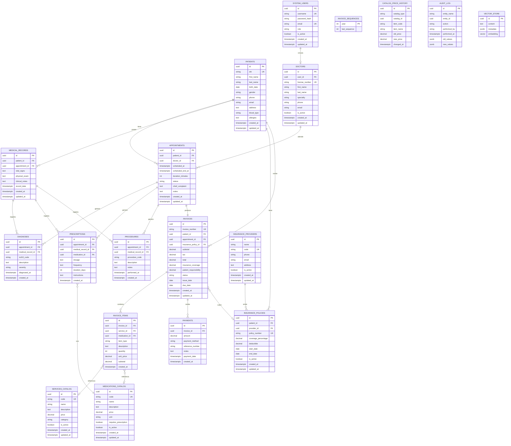

# Diagram viewer

```mermaid

erDiagram
    PATIENTS ||--o{ APPOINTMENTS : "tiene"
    PATIENTS ||--o{ MEDICAL_RECORDS : "posee"
    PATIENTS ||--o{ INSURANCE_POLICIES : "tiene"
    PATIENTS ||--o{ INVOICES : "recibe"

    SYSTEM_USERS ||--o| DOCTORS : "vincula"

    DOCTORS ||--o{ APPOINTMENTS : "atiende"

    APPOINTMENTS ||--o{ DIAGNOSES : "genera"
    APPOINTMENTS ||--o{ PRESCRIPTIONS : "genera"
    APPOINTMENTS ||--o{ PROCEDURES : "genera"
    APPOINTMENTS ||--|| INVOICES : "produce"

    MEDICAL_RECORDS ||--o{ DIAGNOSES : "registra"
    MEDICAL_RECORDS ||--o{ PRESCRIPTIONS : "registra"
    MEDICAL_RECORDS ||--o{ PROCEDURES : "registra"

    INVOICES ||--o{ INVOICE_ITEMS : "contiene"
    INVOICES ||--o{ PAYMENTS : "recibe"
    INVOICES }o--o| INSURANCE_POLICIES : "cubre"

    INVOICE_ITEMS }o--o| SERVICES_CATALOG : "referencia"
    INVOICE_ITEMS }o--o| MEDICATIONS_CATALOG : "referencia"

    PRESCRIPTIONS }o--|| MEDICATIONS_CATALOG : "usa"

    INSURANCE_PROVIDERS ||--o{ INSURANCE_POLICIES : "emite"

    PATIENTS {
        uuid id PK
        string dni UK
        string first_name
        string last_name
        date birth_date
        string gender
        string phone
        string email
        text address
        string blood_type
        text allergies
        timestamptz created_at
        timestamptz updated_at
    }

    SYSTEM_USERS {
        uuid id PK
        string username UK
        string password_hash
        string email UK
        string role
        boolean is_active
        timestamptz created_at
        timestamptz updated_at
    }

    DOCTORS {
        uuid id PK
        uuid user_id FK
        string license_number UK
        string first_name
        string last_name
        string specialty
        string phone
        string email
        boolean is_active
        timestamptz created_at
        timestamptz updated_at
    }

    APPOINTMENTS {
        uuid id PK
        uuid patient_id FK
        uuid doctor_id FK
        timestamptz scheduled_at
        timestamptz scheduled_end_at
        int duration_minutes
        string status
        text chief_complaint
        text notes
        timestamptz created_at
        timestamptz updated_at
    }

    MEDICAL_RECORDS {
        uuid id PK
        uuid patient_id FK
        uuid appointment_id FK
        text vital_signs
        text physical_exam
        text clinical_notes
        timestamptz record_date
        timestamptz created_at
        timestamptz updated_at
    }

    DIAGNOSES {
        uuid id PK
        uuid appointment_id FK
        uuid medical_record_id FK
        string icd10_code
        text description
        string severity
        timestamptz diagnosed_at
        timestamptz created_at
    }

    PRESCRIPTIONS {
        uuid id PK
        uuid appointment_id FK
        uuid medical_record_id FK
        uuid medication_id FK
        text dosage
        text frequency
        int duration_days
        text instructions
        timestamptz created_at
    }

    PROCEDURES {
        uuid id PK
        uuid appointment_id FK
        uuid medical_record_id FK
        string procedure_code
        text description
        text notes
        timestamptz performed_at
        timestamptz created_at
    }

    INVOICES {
        uuid id PK
        string invoice_number UK
        uuid patient_id FK
        uuid appointment_id FK
        uuid insurance_policy_id FK
        decimal subtotal
        decimal tax
        decimal total
        decimal insurance_coverage
        decimal patient_responsibility
        string status
        date issue_date
        date due_date
        timestamptz created_at
        timestamptz updated_at
    }

    INVOICE_ITEMS {
        uuid id PK
        uuid invoice_id FK
        uuid service_id FK
        uuid medication_id FK
        string item_type
        text description
        int quantity
        decimal unit_price
        decimal subtotal
        timestamptz created_at
    }

    PAYMENTS {
        uuid id PK
        uuid invoice_id FK
        decimal amount
        string payment_method
        string reference_number
        text notes
        timestamptz payment_date
        timestamptz created_at
    }

    INSURANCE_PROVIDERS {
        uuid id PK
        string name
        string code UK
        string phone
        string email
        text address
        boolean is_active
        timestamptz created_at
        timestamptz updated_at
    }

    INSURANCE_POLICIES {
        uuid id PK
        uuid patient_id FK
        uuid provider_id FK
        string policy_number UK
        decimal coverage_percentage
        decimal deductible
        date start_date
        date end_date
        boolean is_active
        timestamptz created_at
        timestamptz updated_at
    }

    SERVICES_CATALOG {
        uuid id PK
        string code UK
        string name
        text description
        decimal price
        string category
        boolean is_active
        timestamptz created_at
        timestamptz updated_at
    }

    MEDICATIONS_CATALOG {
        uuid id PK
        string code UK
        string name
        text description
        decimal price
        string unit
        boolean requires_prescription
        boolean is_active
        timestamptz created_at
        timestamptz updated_at
    }

    INVOICE_SEQUENCES {
        int year PK
        int last_sequence
    }

    CATALOG_PRICE_HISTORY {
        uuid id PK
        string catalog_type
        uuid catalog_id
        string item_code
        string item_name
        decimal old_price
        decimal new_price
        timestamptz changed_at
    }

    AUDIT_LOG {
        uuid id PK
        string entity_name
        uuid entity_id
        string action
        string performed_by
        timestamptz performed_at
        jsonb old_values
        jsonb new_values
    }

    VECTOR_STORE {
        uuid id PK
        text content
        jsonb metadata
        vector embedding
    }


```